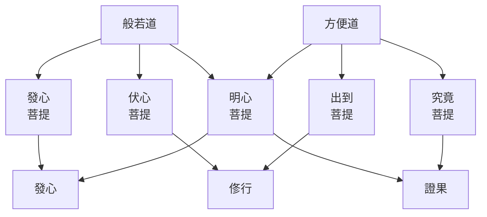
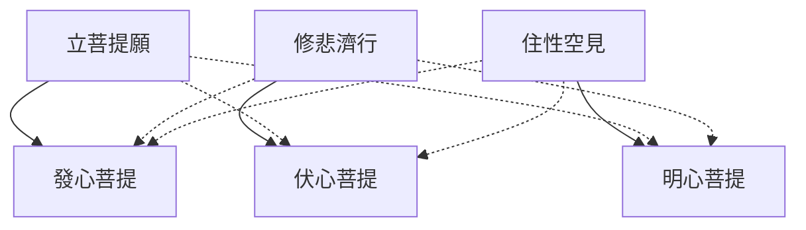

# 金剛般若波羅蜜經講記
——民國三十一年春講於四川法王學院——
## 懸論
　《金剛經》，在中國佛教界，流行極為普遍。如三論、天臺、賢首、唯識各宗，都有注疏。尤以唐宋來盛極一時的禪宗，與本經結有深厚的因緣。傳說：參禮黃梅的六祖慧能，就是聽了本經「應無所住而生其心」而開悟的。六祖以前，禪宗以《楞伽》印心，此後《金剛經》即代替了《楞伽》。宋代，出家人的考試，有《金剛經》一科，可見他的弘通之盛！本經的弘通，也有他的特殊因緣。中國佛教的特點，一重實行：如臺、賢、禪、淨各宗，都注重行持，尤重於從定發慧的體悟。二好簡易，國人的習性好簡，卷帙浩繁的經論，是極難普遍流通的。本經既重般若的悟證，卷帙又不多，恰合中國人的口味，所以能特別的盛行起來！

　本經的文義次第，是極為難解的。「修多羅次第所顯」[^1]，如不明全經的文義次第，即不能理解一經的宗趣。無著說：「金剛難壞句義聚，一切聖人不能入」[^2]。世親說：「法門句義及次第，世間不解離明慧」[^3]。本經文義次第的艱深，實為印度學者所公認！所以，我國本經的注疏雖多，大抵流於泛論空談，少有能發見全經脈絡而握得宗要的！關於這，我想多少提供一點意見。

### 一　釋經題
#### 一、金剛：
　本經名金剛般若波羅蜜經，試為分離而綜合的解說。金剛，為世間寶物，即金剛石之類。世間的金剛，屬於炭質的化合物，有三種特點：(一)、堅常：堅是堅固，即不易破壞；常是不變，即不易轉化。(二)、明淨：明是透明的，能反映各種色采而閃鑠地放光；淨是純潔的，即使落在汙穢的地方，也還是那樣的清淨不染。(三)、快利：他的力用極強，能破壞一切固體物，而鐵石等卻不能摧壞他。然金剛實有二類：(一)、金剛寶，如菩薩寶冠所莊嚴的。(二)、世間金剛石之類。世間的金剛，雖不易破壞而還是可壞的。《智論》說：把金剛放在龜殼上，用羊角去捶擊，即可以破碎。唯有菩薩莊嚴的金剛寶，才真的能壞一切而不為一切所壞。

#### 二、般若：
　般若，華言慧。從前，須菩提在般若會上，曾提出四個問題——何者般若，何名般若，般若何用，般若屬誰。今隨順龍樹論而略為解說：

　(一)、何者般若：佛說的般若，到底是什麼？依佛所說的內容而論，略有三種：(1)實相般若：《智論》說：「般若波羅蜜者，是一切諸法實相，不可破，不可壞」。如經中說的「菩薩應安住般若波羅蜜」，即指實相而言。(2)觀照般若：觀照，即觀察的智慧，《智論》說：「從初發心求一切種智，於其中間，知諸法實相慧，是般若波羅蜜」[^4]。(3)文字般若：如經中說：「般若當於何求？當於須菩提所說中求」[^5]，此即指章句經卷說的。

　(1)實相般若：實相即諸法如實相，不可以「有」、「無」等去敘述他，也不可以「彼此」、「大小」等去想像他，實相是離一切相——言語相、文字相、心緣相，而無可取著的。《智論》說：「般若如大火聚，四邊不可觸」[^6]；古德說：「說似一物即不中」[^7]，都指示這超越戲論而唯證相應的實相。凡夫的所知所見，無不為自性的戲論所亂，一切是錯誤的。這種虛誑妄取相，不但不見如實空相，也不能如實了達如幻的行相。從見中道而成佛的圓證實相說：從畢竟寂滅中，徹見一切法的體、用、因、果，離一切相，即一切法。如《法華經》說：「唯佛與佛乃能究盡諸法實相，所謂：諸法如是相，如是性，如是體，如是力，如是作，如是因，如是緣，如是果，如是報，如是本末究竟等」[^8]。所以，空寂與緣起相，無不是如實的。但這是非凡愚的亂相、亂識所得，必須離戲論的虛誑妄取相，那就非「空無所得」不可。所以，經論所說的實相，每側重於如實空性、無性。要見性相、空有無礙的如實相，請先透此「都無所得」一關——迷悟的關鍵所在。

　實相——約理性邊說，是空還是有？《中論》說：「空則不可說，非空不可說，共不共叵說，但以假名說」[^9]。實相非凡常的思想，世俗的語言可表達，這如何可以說是空是有，更因此而諍論？然而，實相非離一切而別有實體，所以不應離文字而說實相。同時，不假藉言說，更無法引導眾生離執而契入，所以「不壞假名而說法性」[^10]，即不妨以「有」、「空」去表示他。《中論》說：「一切實非實，亦實亦非實，非實非非實，是名諸佛法」[^11]。末句，或譯「諸法之實相」[^12]。眾生的不能徹悟實相，病根在執有我法的自性；所以見色聞聲時，總以為色聲的本質是這樣的，確實是這樣的，自己是這樣的。由於這一根本的執見，即為生死根本。所以，經中所說的實相，處處說非有，說自性不可得。本經也說：「凡所有相，皆是虛妄；若見諸相非相，則見如來」。高揚此實相無相的教說，尊為「不二解脫之門」[^13]。即是說：實相非空非有，而在「寄言離執」的教意說，實相是順於「空」的；但不要忘卻「為可度眾生說是畢竟空」[^14]！

　有人說：實相是客觀真理，非佛作亦非餘人作，是般若所證的。有人說：實相為超越能所的——絕對的主觀真心，即心自性。依《智論》說：「觀是一邊，緣是一邊，離此二邊說中道」[^15]。離此客觀的真理與絕待的真心，纔能與實相相應。實相，在論理的說明上，是般若所證的，所以每被想像為「所」邊。同時，在定慧的修持上，即心離執而契入，所以每被倒執為「能」邊。其實，不落能所，更有什麼「所證」與「真心」可說！

　(2)觀照般若：再作三節解說：凡、外、小智之料簡：1.世間凡夫也各有智慧，如文學的創作，藝術的優美，哲學與科學的昌明，以及政治、經濟等一切，都是智慧的結晶；沒有智慧，就不會有這些建樹。但這是世間的，利害參半的。如飛機的發明，在交通便利上，是有益人群的；但用他來作戰，就有害了。常人所有的「俗智俗慧」，偏於事相的，含有雜染的，不能說是般若。2.外道也有他們的智慧，像印度的婆羅門，西歐的基督教等。他們的智慧，以人間為醜惡的，痛苦的，要求升到一個美妙的、安樂的天國。於是乎行慈善，持戒，禱告，念誦，修定等。這種希求離此生彼的「邪智邪慧」，如尺蠖的取一捨一，沒有解脫的可能，不能說是般若。3.二乘行者得無我我所慧，解脫生死，可以稱為般若；但也不是《般若經》所說的般若。大乘的諸法實相慧，要有大悲方便助成的；悲智不二的般若，決非二乘的「偏智偏慧」可比。離此三種，菩薩大悲相應的平等大慧，才是般若。

　空、般若、菩提之轉化：《智論》說：「般若是一法，隨機而異稱」[^16]。如大乘行者從初抉擇觀察我法無性入門，所以名為空觀或空慧。不過，這時的空慧還沒有成就；如真能徹悟諸法空相，就轉名般若；所以《智論》說：「未成就名空，已成就名般若」[^17]。般若到了究竟圓滿，即名為無上菩提。所以說：「因名般若，果名薩婆若」[^18]——一切種智。羅什說：薩婆若即是老般若。約始終淺深說，有此三名，實際即是一般若。如幼年名孩童，讀書即名學生，長大務農作工又名為農夫或工人。因此說：「般若是一法，隨機而異稱」[^19]。

　般若、方便之同異：般若是智慧，方便也是智慧。《智論》比喻說：般若如金，方便如熟煉了的金，可作種種飾物。菩薩初以般若慧觀一切法空，如通達諸法空性，即能引發無方的巧用，名為方便。經上說：「以無所得為方便」[^20]。假使離了性空慧，方便也就不成其為方便了！所以，般若與方便，不一不異：般若側重於法空的體證；方便側重於救濟眾生的大行，即以便宜的方法利濟眾生。《智論》這樣說：「般若將入畢竟空，絕諸戲論；方便將出畢竟空，嚴土熟生」[^21]。

　(3)文字般若：文字，指佛所說的一切言教。常人以書籍為文字，其實，文字不盡是書本的。書籍，是依色塵而假立的文字；但佛世卻是以音聲作文字。佛怎麼說，弟子即怎麼聽受。所以，佛經以名句文身而立，而名句文身是依聲假立的。或者偏愛不立文字，以教義的鑽研為文字而加以呵斥，不知言說開示即是文字。凡能表顯意義，或正或反以使人理解的，都是文字相。筆墨所寫的，口頭說的，以及做手勢，捉鼻子、豎拂、擎拳，那一樣不是文字！文字雖不即是實義，而到底因文字而入實義；如離卻文字，即凡聖永隔！此處說的文字，指《大般若經》中的第九分。

　初學般若，應先於文教聽聞、受持，以聞思慧為主。經合理的思考、明達，進而攝心以觀察緣起無自性，即觀照般若，以思修慧為主。如得離一切妄想戲論，現覺實相，即實相般若了。這三者，同明般若而各有所重，如意在實相，即能所並寂而非名言思惟可及。如意在觀慧，即依境成觀，以離相無住的相應為宗。如意在文字，即重在安立二諦，抉擇空有。

　(二)、何名般若：為什麼稱為般若？在這一問題中，即抉示出般若究竟指什麼？應該說：般若是實相；觀慧與文字，是約某種意義而說為般若的。如觀慧，因依之深入而能現覺實相——般若，所以也稱為般若。觀慧是因，實相是——非果之果，即是因得果名。又，實相不是所觀的，但觀慧卻緣相而間接的觀察他；為境而引生觀慧，所以也可假說為從境——實相般若而名為般若。至於文字，約他的能詮實相，及藉此能詮教而起觀，得證實相——般若，所以也就從所詮而名為般若。

　般若，本是世間舊有的名詞，指智慧而言。但佛陀所要開示的，即正覺現證的——能所不二的實相，本非世間「般若」的名義所能恰當，但又不能不安立名言以化導眾生。從由觀慧為方便而可能到達如實證知的意義說，還是採用「般若」一名。不過，雖稱之為般若，而到底不很完備的，所以《智論》說：「般若定實相，智慧淺薄，不可以稱」[^22]。

　(三)、般若何用：從般若是實相說，這是萬化的本性——一切法畢竟空故，世出世法無不依緣而成立。這是迷悟的根源——眾生所以有迷有悟，凡夫所以有內有外，聖人所以有大有小，有究竟有不究竟，皆由對於實相的迷悟淺深而來，所以本經說：「一切賢聖皆以無為法而有差別」。

　從般若是觀慧與實相相應慧說，可有二義：(1)證真實以脫生死：一切眾生，因不見性空如實相，所以依緣起因果而成為雜染的流轉。要解脫生死，必由空無我慧為方便。這觀慧，或名正見，或名正觀，或名正思惟，或名毘鉢舍那，或名般若。從有漏的聞思修慧，引發能所不二的般若，才能離煩惱而得解脫。解脫道的觀慧，唯一是空無我慧，所以說：「離三解脫門，無道無果」[^23]。(2)導萬行以入智海：大乘般若的妙用，不僅為個人的生死解脫，而重在利他的萬行。一般人修布施、持戒等，只能感人天善報，不能得解脫，不能積集為成佛的資糧。聲聞行者解脫了生死，又缺乏利濟眾生的大行。菩薩綜合了智行與悲行，以空慧得解脫；而即以大悲為本的無所得為大方便，策導萬行，普度眾生，以此萬行的因華，莊嚴無上的佛果。要般若通達法性空，方能攝導所修的大行而成佛。這二種中，證真實以脫生死，是三乘般若所共的；導萬行以入智海，是菩薩般若的不共妙用。

　(四)、般若屬誰：約實相般若說，這是三乘所共證的，即屬於三乘聖者。約觀慧般若說，如約解脫生死說，般若即通於三乘。所以經中說：「欲學聲聞地，當應聞般若波羅蜜。欲學辟支佛地，應聞般若波羅蜜。欲學菩薩地，亦當應聞般若波羅蜜」[^24]。但佛說般若波羅蜜經，實為教化菩薩，即屬於菩薩。如本經說：「為發大乘者說，為發最上乘者說」。《解深密經》也說：第二時教「惟為發趣修大乘者說」[^25]。不過，佛說般若，雖說但為菩薩，而也有二乘在座旁聽。經說：要得二乘果，必須學般若，這固然是三乘同入一法性，也即是解脫生死的不二門——空無我慧。然也就是密化二乘，使他們聽聞大乘勝法，久久熏習成熟，即可宣告「汝等所行是菩薩道」[^26]，而迴心向大了。所以般若是「通教三乘，但為菩薩」[^27]。從前，成論大乘師說：般若是通教，不夠深刻；唯識大乘師說：般若但為菩薩，不夠普遍。總之，照他們看，般若是不究竟，「通」又不好，「但」又不好，這可說是「般若甚深，諸多留難」[^28]！那裡知道般若通教三乘，但為菩薩，深廣無礙，如日正中！這所以般若於一切大乘經中，獨名為大！

　般若屬於菩薩，為什麼不屬於佛？約般若唯一而貫徹始終說，如來當然也有般若。不過，佛說般若，重在實相慧離言發悟，策導萬行。般若「以行為宗」，所以與側重境相而嚴密分析，側重果德而擬議圓融者不同。

#### 三、波羅蜜：
　梵語波羅蜜，譯為到彼岸，簡譯為度。到彼岸，是說修學而能從此到彼，不是說已經到了。所以，重在從此到彼的行法，凡可由之而出生死到菩提的，都可以稱為波羅蜜。經中或說六波羅蜜，或說十波羅蜜，但真實的波羅蜜，唯是般若，其他都是假名波羅蜜。因為，沒有空慧策導，布施等即不成為波羅蜜了。聲聞乘法，能度生死河到涅槃岸，為什麼不名波羅蜜？因為，波羅蜜又有「事究竟」的意義，所以要能究盡諸法實相，圓成自利利他的一切功德，才名為波羅蜜。聲聞的三無漏學，不能究竟，所以不名為波羅蜜。

#### 四、經：
　梵語修多羅，譯為經。本義是線，線有貫穿、攝持不令散失的作用。如來隨機說法，後由結集者把他編集起來，佛法才能流傳到現在；如線的貫華不散一樣，所以名為經。

　《金剛般若波羅蜜經》，有兩系解說不同：(一)、玄奘等傳說：般若是能斷的智慧，金剛如所斷的煩惱。煩惱的微細分，到成佛方能斷淨，深細難斷，如金剛的難於破壞一樣。所以，譯為「能斷金剛（的）般若」[^29]。(二)、羅什下的傳說：金剛比喻般若。般若能破壞一切戲論妄執，不為妄執所壞；他的堅、明、利，如金剛一樣。然金剛本有兩類：一是能破一切而不為一切所壞的，一是雖堅強難破而還是可以壞的，已如前面所說。所以，或以金剛喻般若，或以金剛喻煩惱，此兩說都是可通的。不過，切實的說，應該以金剛喻般若。考無著的《金剛經論》說：(一)、如金剛杵的「初後闊，中則狹」[^30]；這是以金剛喻信行地、淨心地、及如來地的智體的。(二)、金剛有遮邪顯正二義，不但比喻所遣的邪行，他也是「細牢」的——「細者智因故，牢者不可壞故」[^31]，比喻堅實深細的智因——實相。無著並沒有金剛必喻煩惱的意義，所以法相學者譯為「能斷金剛般若」，值得懷疑！至少，這不是梵本的原始意義。

　般若有二類：一、拙慧：這是偏於事相的分析，這是雜染的，這是清淨的；這是應滅除的，這是應證得的；要破除妄染，才能證得真淨。這如冶金的，要煉去渣滓，方能得純淨的黃金。二、巧慧：這是從一切法本性中去融觀一切，觀煩惱業苦當體即空，直顯諸法實相，實無少法可破，也別無少法可得，一切「不壞不失」。如有神通的，點石可以成金。又如求水，拙慧者非鑿開冰層，從冰下去求水不可；而巧慧者知道冰即是水，一經般若烈火，冰都是水了。所以，巧慧者的深觀，法法都性空本淨，法法不生不滅如涅槃，法法即實相，從沒有減什麼增什麼。這不增不減、不失不壞慧，即金剛般若。

　般若為大乘道體，為五度眼目；為般若所攝持，萬行始能到達究竟佛果，成為波羅蜜。然而，般若也需要眾行的莊嚴，如沒有眾行助成，般若也即等於二乘的偏真智，不成其為波羅蜜。所以，般若為菩薩行的宗主，而又離不了萬行。龍樹因此說：說般若波羅蜜，即等於說六波羅蜜。

　發菩提心者，能以如金剛的妙慧，徹悟不失不壞的諸法如實相，依菩薩修行的次第方便，廣行利他事業，則能到達究竟彼岸——無上菩提，所以名為金剛般若波羅蜜。以文句安布，詮表這甚深法門，所以又稱之為經。

### 二　示宗要

　全經大義，再扼要的提示二點：金剛般若即無上遍正覺：本經以金剛般若為名，而內容多明阿耨多羅三藐三菩提。如佛為須菩提說如此發心，直至究竟菩提，徹始徹終的歸宗於離相無住。說無上遍正覺為「是法平等無有高下」；「於是法中無實無虛」：都是從般若無住以開示無上遍正覺。般若無所住，無所住而生其心；不取諸相，即生實相，即名為佛。須知般若無住的現覺，即離相菩提的分證。依此觀究竟，究竟也如是；依此觀初心，初心也還如此。所以，處處說無上遍正覺，實在即是處處說金剛般若。不過，約修行趨果說，名之為般若無所住；約望果行因說，名之為離相菩提心而已！

　二道即五種菩提：本經初由須菩提問佛：「發阿耨多羅三藐三菩提心，應云何住？云何降伏其心」？經佛解說後，須菩提又照樣的再問一遍，佛答也大致相同。所以，本經明顯的分為兩段。《大般若經》有兩番囑累，《智論》說：「先囑累者，為說般若波羅蜜體竟；今以說令眾生得是般若方便竟，囑累」[^32]。智者即曾依此義，判本經的初問初答為般若道，後問後答為方便道。此二道的分判，極好！

　二道，為菩薩從初發心到成佛的過程中，所分的兩個階段。從初發心，修空無我慧，到入見道，證聖位，這一階段重在通達性空離相，所以名般若道。徹悟法性無相後，進入修道，一直到佛果，這一階段主要為菩薩的方便度生，所以名方便道。依《智論》說：發心到七地是般若道——餘宗作八地，八地以上是方便道。般若為道體，方便即般若所起的巧用。

　般若即菩提，約菩提說：此二道即五種菩提。一、發心菩提：凡夫於生死中，初發上求佛道、下化眾生的大心，名發阿耨多羅三藐三菩提心，所以名為發心菩提。二、伏心菩提：發心以後，就依本願去修行，從六度的實行中，漸漸降伏煩惱，漸與性空相應，所以名為伏心菩提。三、明心菩提：折伏粗煩惱後，進而切實修習止觀，斷一切煩惱，徹證離相菩提——實相，所以名為明心菩提。這三種菩提即趣向菩提道中由凡入聖的三階，是般若道。這時，雖得聖果，還沒有圓滿，須繼續修行。明心菩提，望前般若道說，是證悟；望後方便道說，是發心。前發心菩提，是發世俗菩提心；而明心菩提是發勝義菩提心。悟到一切法本清淨，本來涅槃，名得真菩提心。四、出到菩提：發勝義菩提心，得無生忍，以後即修方便道，莊嚴佛國，成熟眾生；漸漸的出離三界，到達究竟佛果，所以名為出到菩提。五、究竟菩提：斷煩惱習氣究竟，自利利他究竟，即圓滿證得究竟的無上正等菩提。如上所說：二道各有三階，綜合凡五種菩提，總括了菩提道的因果次第。明白此二道、五菩提，即知須菩提與佛的二問二答，以及文段次第的全經脈絡了！

### 三　敘傳譯

　本經的譯者，是姚秦時來華的鳩摩羅什三藏。我國朝代稱秦的，不止一國一代，以帝王的姓氏去分別，即有嬴秦、苻秦、姚秦、乞伏秦等。姚秦，為五胡十六國之一。三藏，即經、律、論，能通達三藏自利利人，所以尊為三藏法師。鳩摩羅什，譯為童壽。父親是印度人，後移居龜茲國；母親是龜茲國的公主。母親生他不久，即出家做了比丘尼，什公也就出家。幼年，到北印的迦溼彌羅，修學聲聞三藏。回龜茲時，經過莎車國，遇到大乘學者須利耶蘇摩，於是回小向大。到得龜茲，已是英俊飽學的法師了。苻秦王苻堅，派呂光攻略龜茲，迎什公來華。呂光攻破龜茲，護送什公回國，在半路上，聽說苻堅在淝水戰敗，呂光即宣告獨立，國號西涼，在今甘肅西部。等到姚秦興起，國王姚興，信奉佛法，特派大兵攻西涼，這才迎什公到了長安。當時，佛教的優秀學者，都集中到長安，從什公稟受大乘佛法。什公一面翻譯，一面講學。所翻的大乘經論很多，如般若、法華、淨名、彌陀等經，智度、中、百、十二門等論，信實而能達意，文筆又優美雅馴，在翻譯界可說是第一流最成功的譯品。所以，什公的譯典，千百年來，受到國人的推崇，得到普遍的弘揚。

　本經，什公第一次譯出。除這，還有五種譯本，就是：元魏菩提留支的第二譯，陳真諦的第三譯，隋達摩笈多的第四譯，唐玄奘的第五譯，唐義淨的第六譯。在六譯中通常流通的，即是什公的初譯。其後的五譯，實是同一法相學系的誦本；如菩提留支譯，達摩笈多譯等，都是依無著、世親的釋本而譯出。唯有什公所譯，是中觀家的誦本，所以彼此間，每有不同之處。要知道印度原本，即有多少出入；如玄奘譯本也有與無著、世親所依本不同處。這點，讀者不可不知！

## 正釋

## 甲一　序分

### 乙一　證信序
![[kmrjv#^1a]]

　本經略分序、正、流通三分。敘述一期法會的因由，名序分。正式開顯當經的宗要，名正宗分。讚歎或囑累流通到未來，名流通分。序分又分證信及發起二序，今先講證信序。

　如是，指這部經。我，是結集者自稱。聞，是從佛陀親聞，或佛弟子間展轉傳聞。結集者說：佛如此說，我如此聽；現在就我所聽來的又如此誦出，真實不虛，一一契合於佛說。依《智論》說：如是，表信：信得過的就說如是，信不過的就說不如是。佛法甚深，「信為能入」[^33]，如沒有真誠善意的信心，即不能虛心領會。如是又表智慧：有智者能如佛所說，不違真義，即可止息戲論與諍競。修學佛法，以信智為根本：無信如無手，不能探取佛法寶藏；無智如無目，不能明達佛法深義。經文首舉如是，即表示唯有信智具足，才能深入佛法，得大利益。

　一時，泛指某一時候，即那一次說法時。因各地的時間不一，曆法不同，不能定說，所以泛稱為一時。

　佛，譯義為覺者，是無上正遍覺者。佛陀創覺了諸法實相，即緣起性空的中道。又從自證中，大悲等流，為眾生開示宣說，以覺悟在迷的眾生。所以，佛是大智慧，大慈悲的究竟圓滿者。

　舍衛，本是城名，應稱為憍薩羅國舍衛城。但古代城邦國家的遺習，每以城名為國名，憍薩羅國的首都在舍衛，所以也稱為舍衛國。舍衛，是聞物的意思，以此城的政治、文化、物產等都很發達，為全印度所聞名的，所以立名為舍衛。

　祇樹給孤獨園，是城外如來居住與說法的地方。如來常住說法，除摩伽陀王舍城外的竹園而外，要算在祇樹給孤獨園的時候最久了。園是給孤獨長者——須達多發心修蓋供養的；樹是波斯匿王王子祇陀奉施的。祇陀的樹林，給孤獨長者的園，所以總名為祇樹給孤獨園。僧眾的住處，名為僧伽藍，即僧園。園，不但是林園，僧眾的智德並茂，大德輩出，好像園林的花木繁茂，馥郁芬芳一樣。所以，僧伽的住處稱為僧園。

　大比丘眾千二百五十人，是聽法的常隨眾。佛在鹿苑，初度憍陳如等五比丘；接著又有耶舍等五十多人，隨佛出家；三迦葉率領他的徒眾，從佛出家，就有一千多眾了；王舍城的舍利弗、目犍連，又帶了二百五十弟子來出家；於是佛的初期出家弟子，就有千二百五十人了。這千二百五十人，不一定在佛前，像舍利弗等大弟子，常時分化一方。經中多標千二百五十人，不過約最初從佛出家者而說。其實，未必全都來會，而新進的比丘極多，又何止千二百五十人？佛的出家弟子，本有比丘、比丘尼、沙彌、沙彌尼、式叉摩那等五眾。但因佛現比丘身，所以住持佛法，以比丘為主。本經的聽眾，除比丘而外，也應該還有比丘尼等，在家的優婆塞、優婆夷、以及護法的天龍等，如流通分所說可知。不過在這證信序中，沒有一一序列出來罷了。比丘，譯為乞士，就是「外乞食以養色身，內乞法以資慧命」[^34]。此千二百五十比丘，都是大阿羅漢，所以說大比丘眾。眾，即僧伽的義譯。千二百五十人的僧團，同住祇園，所以叫俱。嚴格的說：和合僧——眾的形成，論事要具備六和合，論理要同得一解脫，這才稱為俱。

　佛是化主，祇樹給孤獨園是化處，大比丘等是化眾。具備這種種因緣，本經是佛所說的，可以確信無疑了，所以稱這為證信序。

### 乙二　發起序
![[kmrjv#^1b]]![[kmrjv#^1c]]

　爾時，指將啟金剛法會那一天。世尊，是佛的通號之一，即梵語薄伽梵。佛的功德智慧，究竟無上，不但為世間的人天所尊重，也是出世的三乘聖者所尊敬的，所以名為世尊。食時，約為上午九或十點鐘。佛及比丘們，過著乞食的生活，又受過午不食戒。所以，進城去乞食，總在那個時候。佛見乞食的時候到了，所以著衣持鉢進城去。佛制：衣有五衣、七衣、大衣三種。五衣名安荼會，不論睡覺做事，就是大小便，也不離身，這是內衣。七衣名鬱多羅僧，即入眾的常禮服，在大眾中所穿。大衣名僧伽黎，即複衣，在乞食、說法等時所穿的，是佛教大禮服。此處著衣，即大衣。但不定是穿了走，或擔在肩頭，或由侍者拿著，到城村附近，才穿起來。鉢是盛飯的器具，譯義為應量，即隨人的食量而有大小不同。佛用的鉢，傳說是石鉢。成道後，有商人奉麨供佛，但沒有食器。四天王各獻一石鉢，佛就合四為一鉢，所以佛鉢的鉢沿，有四層疊痕。給孤獨園在城外，所以說入城乞食。於其城中次第乞已，是敘述乞食的經過。佛教的乞食制度，是平等行化；除不信三寶不願施食者而外，不得越次而乞，以免世俗的譏毀。乞食以後，即回祇園吃飯。飯吃好了，這又把進城所著的大衣，盛放飯食的鉢，一一的整潔收起。入城乞食是赤足的，路上來回，不免沾染塵埃；佛陀行同人事，所以需要洗足。敷座而坐，並非閑坐，是說隨即敷設座位，端身正坐，修習止觀。如上所說的，乞食屬於戒，坐屬於定，正觀法相屬於慧。又，來往於祇園及舍衛城中，是身業；入定攝心正觀，是意業；下面出定說法，即語業。三業精進，三學相資，為宣說《金剛般若經》的緣起。

　大乘經每以佛陀放光、動地等為發起，而本經卻以入城乞食為開端。《般若經》的中心思想，在悟一切法無自性空，離種種妄執。但不得性空的實義者，信戒無基，妄想取一空，以為一切都可不必要了。不知佛說性空，重在離執悟入，即離不了三學；假使忽略戒行，定慧而說空，決是「惡取空者」。從體悟說：性空離相，不是離開了緣起法，要能從日常生活中去體驗。所以，穿衣、吃飯、來往、安坐，無不是正觀性空的道場！佛將開示般若的真空，所以特先在衣食住行的日常生活中，表達出性空即緣起，緣起即性空的中道。

## 甲二　正宗分
### 乙一　般若道次第
### 丙一　開示次第
#### 丁一　請說
![[kmrjv#^2a]]![[kmrjv#^2b]]![[kmrjv#^2c]]

　本經以須菩提為當機者。在般若法會中，須菩提是聲聞行者，不是菩薩，那他怎能與佛問答大乘呢？這因為般若雖但為大乘，而密化二乘。又因為他與般若法門相契：第一、他是解空第一者，是證得無諍三昧者，於性空深義能隨分徹了。其次，他有慈悲心，哀愍眾生的苦迫，所以不願與人諍競。得大智慧，能從慈悲心中發為無諍的德行，有菩薩氣概，所以《般若經》多半由他為法會的當機者。

　長老，是尊稱。凡年高的；或德高的，如淨持律儀、悟解深法、現證道果，都稱長老。須菩提，是梵語，譯作空生或善現。傳說：他誕生時，家內的庫藏財物忽然不見；不久，財物又自然現出，所以立名須菩提。佛弟子請佛說法，是有應行禮儀的。所以須菩提在大眾中，即從座而起，偏袒了右肩，右膝著地，合掌問佛。袒，是袒露肉體。比丘們在平時，不論穿七衣或大衣，身體都是不袒露的。要在行敬禮時，這才把右肩袒露出來。跪有長跪、胡跪，右膝著地是胡跪法。袒右跪右，以表順於正道；合掌當胸以表皈向中道。如論事，這都是印度的俗禮。

　須菩提隨順世俗，先讚歎釋尊說：太希有了！世尊！如來善於護念諸菩薩，又能善巧的付囑諸菩薩！這太希有了！如來，即佛號多陀阿伽陀的義譯。梵語本有三種意思：即從如實道中來的，如法相而解的，如法相而說的；通常但譯為如來。什麼叫護念？什麼叫付囑？護念即攝受，對於久學而已入正定聚的菩薩，佛能善巧的攝受他，使他契入甚深的佛道，得如來護念的究竟利益。經說菩薩入地，有佛光流灌或諸佛親為摩頂等，即是心同佛心而得佛慧攝受的明證。付囑，即叮嚀教誡，對於初學而未入正定聚的菩薩，佛能善巧教導，使他不捨大乘行，能勇猛的進修。又可以說：佛能護念菩薩，使他自身於佛法中得大利益；佛能付囑菩薩，使他能追蹤佛陀的高行，住持佛法而轉化他人。總之，佛能護念菩薩，付囑菩薩，所以大乘佛法能流化無盡。教化菩薩的善巧，早為須菩提所熟知，所以先就此推尊讚揚如來，以為啟問大乘深義的引言。有解說為：須菩提「目擊道存」，「言前薦取」，所以殷勤讚歎，這可說是別解中極有意義的。

　接著，須菩提問佛：發阿耨多羅三藐三菩提心的善男女們，應怎樣的安住其心？怎樣的降伏其心？此二問，是為發大菩提心者問的，所以什麼是發阿耨多羅三藐三菩提心，應先有明確的了解。阿耨多羅，譯為無上；三藐，譯遍正；三菩提，譯覺：合為無上遍正覺。這是指佛果的一切，以佛的大覺為中心，統攝佛位一切功德果利。單說三菩提——正覺，即通於聲聞、緣覺，離顛倒戲論的正智。遍是普遍，遍正覺即於一切法的如實性相，無不通達。但這是菩薩所能分證的，唯佛能究竟圓滿，所以又說無上。眾生以情愛為本；佛離一切情執而究竟正覺，所以以大覺為本。發阿耨多羅三藐三菩提心，即是發成佛的心。發心，即動機，立志，通於善惡；發阿耨多羅三藐三菩提心，即是第一等的發心。以崇高、偉大、無上、究竟的佛果為目標，發起宏大深遠的誓願，確立不拔的信心，這名為發無上遍正覺心。但是，為什麼要成佛？要知道：大菩提心是從大悲心生的；所以發心成佛，與救度眾生有必然的關係。經上說：「菩薩但從大悲心生，不從餘善生」[^35]；「為利眾生而成佛」[^36]，都是此意。由於悲心的激發，立定度生宏願，以佛陀為軌範，修學大悲大智大勇大力，以救度一切眾生，名為發菩提心。因此，如貪慕成佛的美名，但為個己的利益，那是菩提心都不會成就，何況成佛！

　應云何住與云何降伏其心，可通於二義：一、立成佛的大願者，應當怎樣安住，怎樣降伏其心？一、怎樣安住，怎樣降伏其心，纔能發起成就菩提心？住，龍樹釋為「深入究竟住」[^37]。凡發大菩提心者，在動靜、語默、來去、出入、待人接物一切中，如何能使菩提心不生變悔，不落於小乘，不墮於凡外，常安住於菩提心而不動？所以問云何應住。眾生心中，有種種的顛倒戲論，有各式各樣的妄想雜念，這不但障礙真智，也是菩提心不易安住的大病。要把顛倒戲論，一一的洗淨，所以問云何降伏其心。住是住於正，降伏是離於邪；住是不違法性，降伏是不越毘尼。但此住與降伏，要在實行中去用心。如本經即在發菩提心——願菩提心，行菩提心，勝義菩提心等中，開示悟入此即遮即顯的般若無所住法門。無住與離相，即如是而住，即如是降伏其心。

　什公所譯，唯有此二問。此二——住與降伏，於菩提心行上轉；全經宗要，不過如此住於實相而離於戲論而已。諸異譯，於住及降伏間，更有「云何修行」一問。考無著論，此三問遍通於一切，即於發心——發起行相，及修行——行所住處，都有這願求的住，無分別相應的行，折伏散亂的降伏，與本譯意趣相近。世親釋論，將此三問別配三段文，隔別不融，與本譯即難於和會。

#### 丁二　許說
![[kmrjv#^2d]]![[kmrjv#^2e]]![[kmrjv#^2f]]

　佛聽了須菩提的讚歎與請問，就印可讚歎他說：好得很！好得很！你說得真不錯！如來的確是能善巧護念諸菩薩，能善巧付囑諸菩薩的。現在，我要給你說發大菩提心的，應當這樣的安住，應當這樣的降伏其心：你仔細聽吧！須菩提得到了如來的應允，歡喜的回答說：是的，世尊！我們都願意聽你的教誨！

　如是住及如是降伏其心，約全經文義次第說，當然是指如來下文開示。但古德曾解說為：如上文所說的——乞食、著衣、持鉢、入城、洗足等，那樣安住，那樣降伏其心。須菩提的「唯然」，即契見如來的深意，這真是富有新意的別解！

#### 丁三　正說
#### 戊一　發心菩提
![[kmrjv#大乘正宗]]

　發心菩提，即初發為度眾生而上求佛道的大願，也稱為願菩提心。自所有一切眾生之類至而滅度之，是菩薩的大悲心行。自如是滅度至即非菩薩，是與般若無相相應，要這樣降伏其心，安住其心，悲願為本的菩提心，才能成就而成為名符其實的菩薩。

　菩薩，是菩提薩埵的簡稱。薩埵是眾生——新譯有情，菩提是覺。發心上求大覺的眾生；或上求大覺，下化眾生的，名為菩薩。菩薩以菩提心為本，離了菩提心，即不名為菩薩。摩訶薩，是摩訶薩埵的簡稱。摩訶譯為大；菩薩在一切眾生——凡夫，小乘中為上首，所以名摩訶薩。還有，薩埵，在凡夫以情愛的衝動為中心，生存鬥爭，一切互相的爭執、殘殺，都由此情愛的妄執所引發。眾生的情愛勝於智慧，所以一言一動，都以一己、一家、一族、一國的利益為前提，甚而不顧眾生多數的福樂。菩薩發菩提心，以智慧淨化情愛，發為進趣菩提，救度眾生的願樂；於是乎精進勇猛的向上邁進，但求無上的智慧功德，但為眾生的利益，此心如金剛，勇健、廣大，所以又名摩訶薩埵（薩埵即勇心）。應如是降伏其心，即於菩薩應發的度生大願中，不著一切眾生相。

　所有一切眾生之類，是總舉一切眾生。眾生是五眾和合，生死流轉的眾生。一切眾生，可以分作三類說：一、從眾生產生的方式說，有四種：卵生，如飛禽等。先由母體生卵，與母體分離，再加孵化而產生。胎生，如人獸等。起先也類似卵，但不離母體，一直到肢體完成，才離母體而生。溼生，如昆蟲等。先由母體生卵，離母體後，祇攝受一些水分及溫度，經過一變再變，才達到成蟲階段。化生，如天上的眾生，都是由業力成熟而忽然產生的。二、從眾生自體的有沒有色法——物質說，有二類：有色的，如欲界與色界的眾生。無色的，是無色界眾生。關於無色界，有說是沒有粗色，細色是有的。有說：細色也沒有，僅有心識的活動。三、從眾生的有沒有心識說，有三類：有想的，如人類及一般的天趣。無想的，這是外道無想定的果報，名無想天。這無想的眾生，有說：只是沒有粗顯的心識，微細的心識是有的。有的說：什麼心識也不起。非想非非想的，是無色界非想非非想處的眾生。他實在是有想的，但印度某些宗教師，以為到達非想非非想處，就是涅槃解脫了。所以，佛法中稱之為非想非非想，即雖沒有粗想——非有想，但還有細想——非無想；還取著三界想，沒有能解脫呢！

　發菩提心，本經以大悲大願去說明；可見離了大悲大願，即沒有菩薩，也沒有佛道可成。以度生為本的菩提心，第一，是廣大的：不但為一人，一些人，或一分眾生，而是以一切眾生為救拔的對象。又是徹底的：眾生的苦痛無邊，冷了給他衣穿，餓了給他飯吃，病了給他醫藥，都可解除眾生的痛苦；政治的修明，經濟的繁榮，學術的進步，也著實可以減輕眾生的痛苦。但苦痛的根源沒有拔除，都是暫時的，局部的，終非徹底的救濟。所以，菩薩的大菩提心，除了這些暫時的局部的而外，要以根本解脫的無餘涅槃去拯拔眾生。涅槃為名詞，指解脫生死苦迫的當體；滅度是動詞，即使眾生於涅槃中得到眾苦的解脫。涅槃本不可說一說多，然依世俗施設來說，即有凡外與佛法的不同。世俗有人說：冷了餓了，有饑寒的苦迫；如生活富裕，豐衣足食，這就是涅槃。涅槃的字義，有消散的意思，即苦痛的消除而得自在。所以俗人拍著吃飽的肚子說：這就是涅槃。有些外道，以四禪八定為涅槃；不知這祇是定境的自我陶醉，暫時安寧，不是徹底的。佛法說涅槃，有二：一、有餘（依）涅槃：通達一切法的寂滅性，離煩惱而得到內心的解脫，即是涅槃。但由前生惑業所感的果報身還在，從身體而來的痛苦，還未能解除。所以，即使是阿羅漢，饑寒老病的身苦，還是一樣的。二、無餘（依）涅槃：無學捨身而入無量無數的法性，不再有物我、自他、身心的拘礙，名為無餘。菩薩發願度生，願使每一眾生都得此究竟解脫，所以說：我皆令入無餘涅槃而滅度之。無餘涅槃，為三乘聖者所共入，菩薩也會歸於此。菩薩安住無住大涅槃，即此無餘涅槃的無方大用，能悲願無盡，不證實際罷了！本經以無餘涅槃度脫一切眾生，即本於三乘同入一法性，三乘同得一解脫的立場；也就因此「通教三乘」而==寬鬆==「但為菩薩」。

　菩薩願滅度無限量、無計算、無邊際的眾生，但在菩薩的菩提心行中，不見有一個眾生得滅度的。《般若經》也說：「我當以三乘法拔濟一切有情，皆令於無餘涅槃界而般涅槃；我當雖以三乘滅度一切有情，而實不見有情得滅度者」[^38]。何以不見有情？因菩薩觀緣起相依相成，無自性可得，通達自身眾生身為同一空寂性，無二無別，不見實有眾生為所度者。必如此，纔是菩薩的大菩提心，纔能度一切眾生。否則，即執有我相、人相、眾生相、壽者相，離空無我慧——般若的悲願，即不能降伏其心而安住菩提心了，即不成其為菩薩了！

　通達我、人、眾生、壽者的無相，即般若慧的妙用。在大乘行中，般若是遍通一切的，不論四攝、六度、三解脫、四無量以及一切智、一切種智，無不以般若慧而徹悟他的空無自性。所以，菩提心是即空的菩提心，與菩提心相應的悲願，即無緣大悲。見到眾生的痛苦，生起濟拔的惻隱心，以世間的財法去救濟他，是眾生緣悲。如見眾生為相續、和合的假我，法生苦生，法滅苦滅，因而起悲濟心，是法緣悲。如能觀諸法從緣，都無真實的自性，悟入法性空，緣即空而緣起的假我，生大悲心，願度如幻眾生，這是無緣大悲。無緣大悲，即與般若相應的大悲。悟了眾生空寂無自性，所以雖度脫一切而實無眾生得滅度者。如海中印現的明月，由於風吹波動而月相不見了。從他的不見說，好似滅去了，其實那有自體可滅呢！發心菩提，重在發願度生，所以也就重於我空。

　我、人、眾生、壽者，都是眾生的異名；《般若經》中有十六種異名，都不外從眾生的某一特性而立名，眾生即執此為實有。我，是主宰義，即每一眾生的行動，常人都有自己作主與支配其他（宰）的意欲，所以稱為我。人，行人法，所以名為人。眾生，約現在說：即五眾和合生的——有精神與物質和合的；約三世說：即由前生來今生，今生去後生，不斷的生了又死，死了又受生，與補特伽羅的意義相合。壽者，說眾生的從生到死，成就命根，有一期的生命相續。以般若正觀，即無我、人、眾生、壽命的實性可得。但在五眾和合的緣起法中，有無性從緣的和合相續——假我；依此假名眾生，成立業果相續，生死輪迴。眾生不知無我而執為實有我及我所，所以起惑造業，生死不了；如達自性空而離自我的妄執，即能解脫而入無餘涅槃。

　菩薩發菩提心，以大悲為根本，即菩提心由大悲而發起；大悲所發的菩提心，非般若空無我慧，不得成就，即要以般若為方便。悲心不具足而慧力強，要退墮聲聞乘的。慧力不足而悲心強，要流於世俗而成所謂「敗壞菩薩」[^39]的。必須大悲，般若相輔相成，才能安住菩提而降伏其心。《般若經》說：「一切智智相應作意（即菩提心），大悲為上首，無所得——即般若空慧為方便」[^40]。發菩提心者，不可不知！

#### 戊二　伏心菩提
![[kmrjv#妙行無住]]

　發菩提心，不單是心念而已，要有踏實的事行去救眾生。從救度眾生中，降伏自己的煩惱，深入清淨的實相，達到自利利他的圓成。所以，在發心菩提——願心菩提以後，應進而修行——行心菩提，漸能折伏煩惱使不現行，七地以前，名為伏心菩提。

　論到菩薩的修行，總括的說，不外乎六波羅蜜。此六度以般若為導，而實彼此相應相攝，一波羅蜜即具足一切波羅蜜。本經發菩提心，以大悲度眾生為首，這與布施——以自己所有的給予眾生，使他離苦得樂，尤為吻合，故本經即以布施為主而統攝利他的六度行。布施如何能攝六度？布施有三：一、財施：以財物賙濟人是財施，以體力甚至犧牲生命去救助人，也是財施。所不同的是：衣食等財物為外財施，體力、心力以及生命等為內財施。這財施，即狹義的施波羅蜜。二、無畏施：令眾生離諸怖畏，這就是持戒與忍辱二波羅蜜。持戒，能處眾不礙大眾，不使人受到威脅不安。如殺人者，使人有生存的威脅；偷盜者，使人有外命（財物）喪失的恐怖等。如能受持禁戒，潔身自守，即不會侵害他人，能使人與人間相安無事了。但人類個性不一，你以戒自守，他卻以非禮待你；如不能感化或設法避免，不能忍受而衝突起來，仍不免相殺相奪，造成人間的恐怖。必須以戒自守——克己，又以忍寬容他人——恕人，才能做到無畏施。三、法施：即精進、禪定、般若三波羅蜜。般若是明達事理的，沒有智慧，即落於顛倒二邊，不知什麼是佛法？是邪是正？那怎能救人？禪定是鑑機的，如內心散亂，貪著世間，我見妄執，即不能洞見時機，不知眾生的根性，即不能知時知機而給予適宜的法藥。精進是雄健無畏的，有了精進，才能克服障難，誨人不倦，利人不厭。這樣，六波羅蜜統攝於布施，為菩提行的根本了。要救眾生，不能不犧牲自己去利他——布施：這必須具足物質救濟，以達到眾生生活等的滿足；必須以戒忍的精神，達到人與人間和樂安寧；又必須以進、定、慧的教化，革新眾生的思想意志，而使之歸於中道。從前，僧團中的「利和同均」「戒和共遵」「見和無諍」，也即是六度精神的實施！

　佛對須菩提說：菩薩行布施——六度利他時，於法應無所住行於布施。這即是說：不要住於色境而行布施，不要住於聲境乃至法境而行布施。於法應無所住的法，指一切法說；香味觸法的法，但指意識所對的別法塵。住，是取著不捨的意思。眾生在六塵境——認識的一切上起意識時，都有自性的執見，以色為實色，以聲為實聲，總以為是確實如此存在的。因為取著六境，即為境所轉而不能自在解脫。菩薩為度眾生而行布施，對於施者、受者、施、施時、施處、施因、施果這一切，當然要能遠離自性的妄取，能不著相而布施，才能真實利濟眾生。否則，覺得有我是能施，他是受施，所施物如何如何，希望受者的報答，希望未來的福報，甚至因而貢高我慢，這都從住於法相而生起來，這那裡還像菩薩行？所以，佛總結的對須菩提說：菩薩修行，應這樣的不住於相——相即六塵境相而行布施！

　不住於相的布施，能降伏煩惱，能安住菩提心，而且所得的福德，廣大得不可思議！有相布施，不能通達三輪性空，所得功德即有限有量。無論功德多麼大，總不過是人天有限的福報。但如能以般若相應而布施，將此布施融歸於法性，迴向於一切眾生而同趨於大覺，功德即無限而不可思量。如以一滴水投入大海中，即遍大海的水性而不可窮盡。為了說明這個，佛便問須菩提說：你的意見怎樣？東方的虛空可思量嗎？南方、西方、北方的虛空，以及四維、上方、下方的虛空，可以思量嗎？須菩提一概否定的說：不可。佛即說：既知道十方虛空是不可思量的，也應該知道菩薩不住相布施的功德，也同虛空一般的不可思量。這並不是以虛空的廣大，形容福德的廣大，而是以虛空的無所有，不可住、不可著、不可說邊際數量，如無相布施的自性不可得一樣。菩薩是應該這樣的安住，這樣的行施，所以如來說：菩薩但應如所教住！無相布施，指空相應布施，通達能施所施畢竟無自性的布施。即空如幻的布施，如此因，如此果，如此利他，如此自利，都法相宛然有而不失不壞。佛怕人以無記心布施，或執理廢事，所以特舉不可思量的功德以顯示布施因果。

　前發心菩提，以願度眾生為主，所以與般若相應即重在我空。伏心菩提以實行利濟為主，所以與般若相應，即重在法空。

#### 戊三　明心菩提

##### 己一　法身離相而見
![[kmrjv#如理實見]]

　明心菩提，約七地菩薩定慧均等，現證法性，得無生法忍而說。證法，即「見法」，「見法即見佛」。佛之所以為佛，即在究竟圓覺緣起空寂的中道；離此正覺，更沒有什麼奇特！如能悟徹緣起法相的空寂，即與佛同一鼻孔出氣。所以說：「見緣起即見法，見法即見佛」[^41]，這才是真切見佛處。上面伏心菩提，廣行利濟眾生，積集了無邊的福智資糧；漸能悲智相扶，定慧均等，「方便成就」，有力現證無分別法性了。因此，佛特舉「見佛」，問須菩提道：取著身相——三十二相、出入來去相、穿衣吃飯相、坐禪說法相，能正見如來嗎？須菩提是過來人，所以說不可。從前，有一次，佛從忉利天來下人間，人間的佛弟子，都歡喜的去見佛。依次序，比丘應在比丘尼之先，但蓮華色尼為了先得見佛，即化作轉輪王，走在最前面。他以為最先見佛了，但佛對他說：不是你先見，「須菩提先見我身」[^42]。原來，那一次，須菩提沒有參加迎佛的勝會。當眾人去見佛時，他想：佛曾說：見法即見佛，我何不正觀法相！於是他就觀察諸法的從緣生滅，從無常為門而悟入諸法無性空，徹見了如來法身。須菩提曾有此體驗，所以佛一提到，他就肯定的說：不可以身相得見如來。這些身相，都不過是假名如幻的妄相；佛的無盡莊嚴，也一樣的絕無少許法可取可得。所以，佛說的身相，即非有身相的實性。如取著假相為佛，即不見如實空相，自也不能深見如來的所以為如來了！

　須菩提但依身相的虛妄說，如來本此原理，又推進一層說：不但如來的身相是虛妄的，所有一切的法相，如山河大地器界相，凡外賢聖眾生相，有礙可壞的色相，明了分別的心相，這一切無不是依緣起滅，虛妄不實的。虛妄的還他虛妄，如不執妄相自性為可見可得，即由諸相非相的無相門，契入法性空寂，徹見如來法身了！從緣起的虛誑妄取相看，千差萬別；從緣起本性如實空相看，卻是一味平等的。法性即一切法自性不可得而無所不在，所以也不須於妄相外另覓法身，能見得諸相非相，即在在直見如來。所以古人說：「山河及大地，全露法王身」。

　般若道三階：發心菩提重於願，伏心菩提重在行，明心菩提重在證。又，初是住菩提心，中是修悲濟行，後是悟如實義。初以般若扶大悲願，中以般若導六度行，後是般若現證。雖各有所重，而菩提願、悲濟行與性空見，實是不可離的。

##### 己二　眾生久行乃信
##### 庚一　問
![[kmrjv#^6a]]

　離一切相的現見法性，非凡常的名言思度可測，真所謂「甚深極甚深，難通達極難通達」[^43]的。所以，須菩提為末世眾生著想，勸學此甚深法門，而啟問如來：未來世中，眾生聽到這樣甚深的法門——言說章句，能有生起真實信心的沒有？

　實信，在聲聞法中，即證須陀洹，得四不壞信——四證淨；大乘在見道淨心地。這是般若相應的證信，非泛泛的仰信可比。由信順而信忍，由信忍而達到信智一如的證信。論到證信，佛世即難能可貴了！何況末世眾生的福薄根鈍呢？須菩提舉此一問，不但說明了能有信者，且說明了證信者的資格；而相似的信解，也知道應該如何了！

##### 庚二　答
###### 辛一　戒慧具足
![[kmrjv#^6b]]

　般若法門雖極難信解，但自有利根障薄而智慧成就的眾生，能信以為實。佛說：在如來滅後，後五百年歲時，多有大心眾生出世，能發心學菩薩行，嚴持戒行，廣習布施的利他福德，智慧深徹，於佛說的般若章句，能生起深切的信心，確信唯此般若法門，為不二的解脫門，能如實悟入深義。從歷史上看：佛滅五百年後，迦膩色迦王治世的時代，大乘教法，廣大流行。《般若經》也說：「五百年後，般若經於北方當作佛事」[^44]。所以，深信此難信法門，確乎是有的。不過，要有「戒足」、「慧目」；如不持戒、不修福、不習禪慧，即不能於這甚深法門，得如實信了！

###### 辛二　久集善根
![[kmrjv#^6c]]

　此人所以能信解悟入甚深法門，因為在過去生中，已於無量千萬佛所，積集深厚的善根了！過去生中，多見佛，多聽法，常持戒，常修福，種得廣大的善根，這才今生能一聞大法，就淨信無疑，或一聞即悟得不壞淨信。在同一法會聽法，有的聽了即深嘗法味，有的聽了是無動於衷；有的鑽研教義，觸處貫通，有的苦下功夫，還是一無所得；這無非由於過去生中多聞熏習，或不曾聞熏，也即是善根的厚薄。要知道：佛法以因果為本，凡能戒正、見正、具福、具慧，能信解此甚深法門，決非偶然，而實由於「夙習三多」[^45]。所以，佛法不可不學，不學，將終久無分了！

###### 辛三　諸佛攝持
![[kmrjv#^6d]]

　過去久種善根，今生能戒慧雙修，聽此深法能生清淨信的，即為十方如來所知所見。如來知見，即上文的護念攝受。佛是大菩提的圓證者；菩提即智慧，菩薩即是具智慧分的，能與如來的大覺相契，所以能常在諸佛悲智的知見攝受之中。知而又見，即明是現量的真知灼見。眾生能淨信甚深法門，能為諸佛所護持，這是怎樣大的福德呀！

###### 辛四　三相並寂
![[kmrjv#^6e]]![[kmrjv#^6f]]![[kmrjv#^6g]]![[kmrjv#^6h]]![[kmrjv#^6i]]

　戒慧成就，久集善根者，為什麼能得如來的護念，得無量福德呢？這因為此類眾生，已能無我相、人相、眾生相、壽者相了；而且還沒有法相及非法相。我、人等四相，合為一我相：無此我相，即離我相的執著而得我空。無法相，即離諸法的自性執而得法空。無非法相，即離我法二空的空相執而得空空。執我是我見，執法非法是我所（法）見；執有我有法是有見，執非法相是無見。般若離我我所、有無等一切戲論妄執，所以說：[^46]。能三相並寂，即能於般若無相生一念清淨心。經上說：「一切法不信則信般若，一切法不生則般若生」[^47]。能契入離相，自能得如來的知見護念了。在「無非法相」[^48]二句。

　悟解三空，方能於般若無相法門得清淨信，此義極為重要。有以為我相可空而法相不空的；有以為我相空卻，法相可以不必空，即是說：執著法有是不妨得我空的；或者以為我法雖空而此空性——諸法的究竟真實，是真常妙有的。現在說：如覺有真實的自性相，有所取著，那不論所著的是法相或空相，不但不悟法空與空空，也不得無我慧，必也是取著我等四相的。所以，我我所見，實為戲論的根源，生死的根源。如真能無我無我所，離一切我執，那也必能離法見、空見的妄執，而能「見諸相非相，即見如來」。這因為我空、法空、空空，僅是所遣執取的對象不同，「而自性空故」的所以空，並無差別。如燒草的火與焚香的火，草火香火雖不同，而火性是同一的。了解草火的性質，就能明白香火的性質。眾生妄執自性相，即確實存在的——甚至是不變的，不待他的妄執。於眾生的自體轉，執有主宰的存在自體，即我執；於所取的法相上轉，執有存在的實性，是法執；這是於有為法起執；如於無為空寂不生不滅上轉，執有存在自性，即非法執。所以，執取法相而不悟法空，執非法相而不悟空空，終究是不能廓清妄執的根源，不知此等於不知彼，所以也不得我空了。

　佛為弟子說法，多說眾生由五眾和合成；此五眾，一切是無常生滅不安隱法，所以色非我非我所，受、想、行、識也非我非我所。無常故無我的教授，利根者當下能依無我無我所，徹見涅槃寂滅。既離我執，也不會再取法相及非法相。佛滅後，有的不能從無常無我中得畢竟空，轉而執我無法有。對此執法眾生，不得不廣顯法空。而或者又撥無我法的緣起，或取執空性為實有離言自性。這都是守指忘月，辜負佛恩！所以，本經又如實開示：不應取相，如執著法相非法相，即執著我相，是不能得無我慧而解脫的。

　不要以為這是大乘不共妙門！這是如來的一道解脫門，所以提醒須菩提說：還記得嗎？我在《筏喻經》中說：「法尚應捨，何況非法」[^49]，即早已開示過了！筏是竹筏，交通不便或水淺的地方，竹筏可用作交通工具。利用竹筏，即能由此岸到彼岸。到了彼岸，竹筏當然捨去了，誰還把他帶著走！眾生在生死海中，受種種苦迫，佛為了濟度他們，說種種法門，以法有除我執，以空相破法執，使眾生得脫生死而到達無餘涅槃。當橫渡生死苦海時，需要種種法門，但度過中流，必須不執法非法相，才能出離生死，誕登彼岸。

　《筏喻經》，出《增一阿含》中。法與非法，有二義：一、法指合理的八正道，非法即不合理的八邪。法與非法，即善的與惡的。如來教人止惡行善；但善行也不可取著，取著即轉生戲論——「法愛生」[^50]，而不能悟入無生。約「以捨捨福」[^51]說，善法尚且不可取著，何況惡邪的非法？二、法指有為相，在修行中即八正道等；非法指平等空性。意思說：緣起的禪慧等功德，尚且空無自性，不可取執，那裡還可以取著非法的空相呢？本經約後義說。從這引阿含教的非法非非法來說，可見前文也應以==寬鬆==「不取法相、不取非法相」為正。諸譯增入「無想無非想」[^52]二句，不足取！

##### 己三　賢聖無為同證
##### 庚一　舉如來為證
###### 辛一　正說
![[kmrjv#無得無說]]

　離一切相的般若，難信難解。上已明未來有人能信能證，以下再以已經能淨信實證的聖賢，來證明此難信難解的可信可證。先舉究竟圓證的如來為證。

　佛問須菩提：今有兩個問題問你：一、如來在菩提樹下成遍正覺，實有阿耨多羅三藐三菩提可證得嗎？二、如來成道後，大轉法輪，確有法可說嗎？佛舉此二問，因菩薩得明心菩提，即分證無上菩提，而佛卻說：「諸相非相」；又說：「不應取法，不應取非法」。恐有人懷疑：佛得阿耨多羅三藐三菩提，不是可得嗎？不又大轉法輪嗎？既可證可說，為什麼說「凡所有相皆是虛妄」？「不應取法，不應取非法」呢？須菩提雖沒有圓證如來境界，但他是無諍行大阿羅漢，憑自己證覺無為空性的體驗，及佛說無相，比知如來聖境而回答說：如佛所說，如我所解，是沒有定性——自性的阿耨多羅三藐三菩提為佛所證，也沒有定性的法為如來所說。須菩提的回答，真是恰到好處！佛陀的現覺，沒有能證所證的差別可得，所謂「無智亦無得」[^53]。如覺有什麼為智慧所得，這那裡還是正覺！論到說法，更沒有定法可說，一切名言不得實義。佛法雖多，不外證法與教法。無證無說，即明如來的自證化他，無不性空離相；因為性空離相，這才成佛說法呢！但無有定法可說，決非隨便亂說。語言不得實相，但在世俗心境的習慣中，也有他的彼此、同異、是非。如東南西北，雖沒有定性，但世俗仍有一定的方向可指；假使指東話西，即是違反世間。世間的一般語言，尚不可亂說，何況佛法！所以，隨順世俗而安立佛法，如來師子吼，常作決定說。

　何以證無可證，說無可說？因佛所說的及所證的法，是沒有定性可以取著的或可說的。取著，約心境的能證所證說；言說，約語言的能詮所詮說。凡是心有所取，口有所說，一切都是自性空的，所以名為非法；一切法非法的無為空寂，也還是不可取不可說，所以又說非非法。佛的自證化他如此，明心菩提也如此。為了顯明這點，所以說：一切賢聖皆以無為法而有差別。大聖佛陀，二乘聖者，大乘菩薩，或還在修證的進程中，或已達究竟極果，這都因體悟無為法而成。無為，即離一切戲論而都無所取的平等空性。無為離一切言說，平等一味，怎麼會有聖賢的差別？這如廣大的虛空——空間，雖可依事物而說身內的空，屋中的空，方空、圓空，但虛空性那裡有此彼差別！虛空雖沒差別，而方圓等空，還是要因虛空而後可說。這樣，無為法離一切戲論，在證覺中都無可取可說，而三乘聖者的差別，卻依無為法而施設。

###### 辛二　校德
![[kmrjv#依法出生]]

　校量功德，在《般若經》中是隨處可見的。信解般若，必然能得大功德。這在悟解空性的聖賢，本是用不著廣說的；但為攝引初學，而怕他們誤解空義而撥無因果，所以特為層層的校量。功德的殊勝，在比較中最容易表顯出來。所以，佛問須菩提說：假使有人以充滿三千大千世界那麼多的七寶，布施貧窮困苦的眾生，或供養自己的父母，受教的師長，信奉的三寶，你說這人所得的功德多不多？七寶，是金、銀、琉璃、玻璃、車渠、赤珠、瑪瑙，這是形容質的貴重。三千大千世界，是一千小千為中千，一千中千為大千的一佛所化世界，這是形容量的眾多。以這樣貴重而又那樣多的七寶作布施，是真有其事嗎？有的說：這是假設的，世間七寶雖多，但總沒有這麼多；經中所說，只是假設校量罷了！有的說：可能是真實的。法身菩薩確能以三千大千世界的七寶，上供十方諸佛，下施六道眾生。

　須菩提回答說：多極了！因所得福德，勝義諦中是沒有真實的福德性可得的。然而，因為法性空無自性，所以如幻緣起，能有一切的眾多福德可起可說。不然，實有的即不從緣起，也就沒有布施福德可說了。須菩提這樣的解說，還是為了聽眾。一面說有緣起，一面又即此緣起而顯空性。恐人聽說大福德，就以為福德有自性，所以必須「隨說隨泯」，攝一切法以趣空。

　佛又對須菩提說，你所說固然不錯，但不要以為那人的福德就算大了！告訴你：假使另有人對於本經，不要說受持全部所得的功德，就是受持一四句偈，或為他人說一四句偈，所得的功德，也是超過那人的布施功德，千倍萬倍而不可計算的。受是領受，持是憶念明記不忘。四句偈，有人說是我等四相，有人說是末了一頌。其實，這是形容極少的意思。偈，有名為首盧迦偈的，是印度人對於經典文字的計算法。不問是長行，是偈頌，數滿三十二字，名為一首盧迦偈。如《般若‧初會》的十萬頌，《金剛般若經》三百頌，都是指首盧迦偈而言。受持四句偈，意思是極少的；而所得的福德極多，即顯示了本經的殊勝。

　修學佛法，不外「聽聞正法，如理作意，法隨法行」[^54]。依此修學的次第而細別起來，或說五法行——如法華，或說六法行等，或總為十法行。十法行是：一、書寫，二、供養，三、施他，四、諦聽，五、披讀，六、受持，七、開演，八、諷誦，九、思惟，十、修習。此中受持與為他人說，即略舉其中的二行。受持是自利，為他人說是利他，能於此甚深法門自利利他，功德當然不可思議。七寶等財施，固然能予人們以物質的滿足，但它是暫時的；法施，能啟發人的正知正見，健全人的品德，引導他向上增進以及解脫、成佛，由此而可得徹底的安樂，所以非財施可及！

　佛所以說這人的功德超過七寶布施，是因為一切佛及佛的阿耨多羅三藐三菩提法，都從此般若性空法門——經典所出生的。《般若經》說：般若為諸佛母。如進一層說：佛說的十二部經，修學的三乘賢聖，也沒有不是從般若法門出生的。沒有般若，即沒有佛及菩薩、二乘，就是世間的人天善法，也不可得。般若為一切善法的根源！得無上遍正覺，所以名為佛；而無上遍正覺，即是老般若。沒有般若因行，那裡會有無上遍正覺，那裡會有佛？此經讚歎般若，及般若契會實相，所以不限於《金剛經》，凡與此般若無相法門相契的，都同樣的可尊。

　諸佛，是佛；阿耨多羅三藐三菩提，是佛所得法。佛與佛所得的法，合名佛法。佛說：所說的佛法，即是非佛法。畢竟空中，確是人法都不可得的。假使就此執為實有佛法，那就錯了！

##### 庚二　舉聲聞為證
![[kmrjv#一相無相]]

　明心菩提所證的諸相非相，是三乘所共入的。上文說：「一切賢聖皆以無為法而有差別」；《十地經》也說二乘能得此無分別法性，所以再引聲聞的自證來證成。《般若經》是教化菩薩的，但也密化聲聞，不要妄執法相非法相，自稱阿羅漢！要知道：般若空為不二門，要是親證聖果的，一定會信解佛說的無我相、無法相、無非法相。《法華經》以此平等大慧為一乘的根柢，所以也說：除去增上慢人，真阿羅漢是決會信受的。所以《般若經》說：二乘的智與斷，都是菩薩無生法忍。這是以聲聞例證菩薩聖境，也即密化聲聞回心大乘。

　佛問須菩提說：證須陀洹果的聖者，他會起這樣的想念：我能得須陀洹果嗎？須菩提曾經歷須陀洹果，所以即回答說：這是不會的。須陀洹的意義，即是入流——或譯預流。有的說：預是參預、參加、加入；得法眼淨，見寂滅性，即預入聖者的流類，所以名為須陀洹。但依本經，應這樣說：契入「法流」，即悟入平等法性，所以名為須陀洹——入流。然而契入法性流，是約世俗說；在現覺法流——勝義自證中，實是無所入的。法法空寂，不見有能證所證，也不見有可證可入。色聲等六塵，即一切境界相，不入此一切境相，才稱他為須陀洹呢！須陀洹是聲聞乘的初果，斷除三結即一切見所斷惑，初得法眼淨而得法身；經七番生死，必入涅槃。

　佛又問：那麼，證得二果的斯陀含，他會自念我能得斯陀含果吧？須菩提也說不會的。因為，斯陀含的意義是一往來——簡稱一來。證得二果的聖者，斷欲界修所斷惑六品，還有下三品，還須一往天上、一來人間受生，方得究竟。但在聖者的現覺中，沒有數量可說，沒有動相可說，那裡會想到此來彼去？聖者通達我法畢竟空，所以不但不會起實有自我的意念，就是自己的來去活動，也是了不可得。

　佛接著又問：證了三果的阿那含，或許會自以為能證阿那含果吧？阿那含，是不來的意思。斷五下分結，即欲界的修惑斷淨，不再來欲界受生，所以名為阿那含——不來。須菩提回答說：也不會的。因為，沒有真實的不來者，是我空；沒有真實的不來法，是法空。阿那含深入法性，不但不著來相，也不著不來相。一般以為來去是動的，沒有來去，那即是不來（不去）的靜止了。其實，不來（不去）即是住；如沒有來去的動相，那裡還有不來不去的靜止相！緣起法中，靜不能離動，離動的靜止不可得；動也不離於靜，離靜的動相也不可得。來與不來，無非是依緣假合，在通達性空離相的聖者，是不會自以為是不來的。

　佛又問：已證極果的阿羅漢，會自以為我得阿羅漢道嗎？須菩提答：不會這麼想。阿羅漢，有三義：一、應供，二、殺賊，三、無生。從阿那含而進斷五上分結，即上界的修所斷惑，得究竟解脫，名為阿羅漢。約他的恩德說：應受人天供養，為世間作大福田，名為應供。約他的斷德說：殺盡一切煩惱賊，名為殺賊。約他的智德說：徹證無生寂滅性，名為無生（得無生智）。凡夫為惑業所拘縛，流轉於生死中。初二三果的聖者，還不免隨惑潤業，而說他還有幾番生死。到阿羅漢，這才惑業乾枯，入於無生而不再感受生死，完成究竟的解脫。這樣的聖者，於五眾的相續和合中，不見一毫的自性法可得，而可以依之稱為阿羅漢的。徹悟一切法的生滅不可得，菩薩名為得無生法忍，聲聞即證無生阿羅漢。生滅都不可得，更有什麼無生可取可得！如見無生，早就是生了！所以，如自以為我是阿羅漢，即有我為能證，無生法為所證，我法、能所的二見不除，就是執著我等四相的生死人，那裡還是真阿羅漢！不過增上慢人而已！

　須菩提是阿羅漢，所以論到這裡，即依自己的體驗說：世尊不是說我在諸大弟子之中，所得的無諍三昧最為第一嗎？不也說我是第一離欲（諸煩惱）的大阿羅漢嗎？世尊這樣的稱歎，可是我從沒有這樣想：我是離欲的大阿羅漢，我能得無諍三昧。假使我這樣隨相計著，那就在我見、法見、非法見的生死界中，佛也就不會說我是一個好樂修習阿蘭那行的人了。反之，因為不執著實有無諍三昧可得可修，世尊才稱歎我行阿蘭那行呢！梵語阿蘭那，即無諍。三昧，即繫心一境的正定。無諍三昧，從表現於外的行相說，即不與他諍執，處處隨順眾生。覺得人世間已夠苦了，我怎麼再與他諍論，加深他的苦迫呢？如從無諍三昧的證境說，由於通達法法無自性，一切但是相依相緣的假名而來。無我，才能大悲；離去空三昧，還有什麼無諍行呢！

　這一章，四番問答，須菩提多隨順空義說。如隨順世俗，那麼，我得須陀洹……我是阿蘭那行，都是可以分別言說的。不過，決不會執取實我與實法而作此念的。

##### 庚三　舉菩薩為證
###### 辛一　正說
###### 壬一　得無生忍
![[kmrjv#^10a]]

　前依聲聞的證境說，此下約得道的菩薩說。佛告須菩提說：我——如來從前在修菩薩行時，在然燈佛的法會中，有沒有實在的法可得？須菩提當然回答沒有的。據說：釋迦在過去修菩薩行時——第二阿僧祇劫滿，曾在雪山修學。學畢，出山。求得五百金錢，想去報答老師。當時，見城中整飾市容，潔淨街道，問起路人，才知是預備歡迎然燈佛的。他想：佛是一切智者，難逢難遇！不能錯失這見佛的機會。於是，把所有的錢，買得五朵金色蓮華，至誠而歡喜的去見佛。見佛及弟子的威儀庠序，動靜安和，從心靈深處生起虔誠的敬信；以所得的五朵華，散向然燈佛。進城的必經道上，有一窪汙水，他就伏在地上，散開自己的頭髮，掩蓋汙泥，讓佛踏過。佛知他的信證法性，得無生忍，所以就替他授記：未來世中當得作佛，名釋迦牟尼。或者以為釋迦——因地——當時在然燈佛處，得了什麼大法，像「別傳」，「秘授」之類，所以舉此問須菩提。須菩提深見法性，所以說實無所得。得無生忍，但是隨世俗說；而實生滅不可得，不生不滅等也不可得，所謂「般若將入畢竟空，絕諸戲論」[^55]。如以為有法可傳可得，那便落於魔道，而不是證於聖性了。

###### 壬二　嚴淨佛土
![[kmrjv#^10b]]![[kmrjv#^10c]]

　得無生法忍的菩薩事業，有二：一、莊嚴佛土，二、成就眾生。有情的根性不一，有僅能得人天功德的，菩薩即以人天的世間福利去成就他。有能得二乘果的，即以出世解脫去成就他。能發菩提心而成佛的，即以大乘的自利利他去成就他。世間是不平等的，醜惡的，苦痛的，如何化濁惡的世界為清淨，轉苦痛的人生為解脫，這是菩薩的唯一事業。濁惡世界的淨化，即莊嚴佛土，這以願力為本。菩薩立大願，集合同行同願的道伴，實踐六度、四攝的善行去莊嚴他。有以為一人成佛，世界即成清淨，這多少有點誤解的。菩薩在因中教化眾生，以佛法攝集同行同願者，同行菩薩行。結果，佛與所化眾生——主伴的功德，相攝相資，完成國土的圓滿莊嚴。同行同願的菩薩，同住於莊嚴的國土中。同中有不同，唯佛能究竟清淨、圓滿、自在。沒有眾會莊嚴的佛土，不過是思辨的戲論！

　如來以莊嚴國土問須菩提：菩薩發心莊嚴佛土，究竟有佛土可莊嚴，有佛土的莊嚴嗎？須菩提本般若性空的正見，回答說：沒有真實的國土可莊嚴，也沒有真實的能莊嚴法。因為，佛土與佛土莊嚴，如幻如化，勝義諦中是非莊嚴的，不過隨順世俗，稱之為莊嚴而已。《般若經》說無莊嚴為莊嚴；《華嚴經》說普莊嚴，都是由於性空慧的徹悟法性，淨願善行所成。國土——世界是緣起假名，所以能廣大莊嚴。沒有自性的世界，即沒有不變性，如遇穢惡的因緣，即成穢惡的世界；如造集清淨的因緣，即自然會有清淨的世界出現。假使，穢惡世界是實有定性而不可改易的，那就是塗抹一些清淨的上去，也不會清淨，反而更醜惡了！所以，世界無定，穢惡與清淨，全依眾生知見行為的邪正善惡而轉。必須知道如此，才會發心轉穢惡的國土為清淨。必須善悟國土莊嚴的非莊嚴，才能隨行願而集成國土的莊嚴。

　眾生的三毒熏心，迷執此穢惡苦迫的世間，以為是安樂、清淨。佛以呵責的法門，說國土無常、苦迫、不淨。佛又以誘導的法門，令眾生不以此現實的世間為樂淨，而從無我大悲的利他行願中，創建嚴淨的世間。但眾生的迷執，是深固的。聽說莊嚴淨土，又在取著莊嚴，為尊貴的七寶，如意的衣食，美妙的香華音樂，不老不死的永生所迷惑了。所以，佛告須菩提：如上所說的莊嚴，凡是修大乘行的菩薩，都應生清淨心，離去取相貪著穢惡根源，不要為淨土的莊嚴相——美麗的色相，宛轉的音聲，芬馥的香氣，可口的滋味，適意的樂觸，滿意的想像等而迷惑！要知色、聲、香、味、觸、法，都如幻如化，沒有真實的自性可得。如取執色等有相可得，這即是三毒的根源，從此起貪、起瞋、起癡，即會幻起種種的苦痛和罪惡。所以，應不住（著相）一切法，不住而住的住於空性，於無可住的法性而生淨心。前說無我相、無法相、無非法相，能生一念清淨信心，即是這裡的生清淨心，無所住而生其心。如此的離相而得淨心，這才能「心淨則國土淨」[^56]。如取著淨土而不能淨心，即縱然進入莊嚴的淨土，那也還是苦痛的，還是穢惡的。如上海，在物質方面，比較優美得多。但他並不配稱為清淨，反而被人咒詛為罪惡的淵藪。這可見莊嚴國土，要從清淨心中去開拓出來！

　莊嚴佛土者，即非莊嚴，是名莊嚴。像這一類型的三句論法，本經是頂多的。或作三諦說；或約三性釋；或約大乘揀別小乘說。今依中觀者說：如莊嚴佛土，是討論觀察的對象。這是緣起的，空無自性的，所以說即非莊嚴。然而無自性空，並不破壞緣起施設，世出世法一切是宛然而有的，所以隨俗說是名莊嚴。緣起，所以無性，無性所以待緣起，因此「即非」[^57]的必然「是名」，「是名」的必然「即非」，即二諦無礙的中道。所以說：「諸佛依二諦，為眾生說法」[^58]。

###### 壬三　成法性身
![[kmrjv#^10d]]

　這一問題，在說明菩薩的法性身。未證諸法如實相的菩薩，他的身體，不過較我們強健、莊嚴，還是同樣的肉身。體悟空相的菩薩身，從證得法性所引生，從大悲願力與功德善業所集成，名為法性生身，非常的殊勝莊嚴。這不是凡夫能見的，凡夫所見的，是大菩薩的化身。佛問：如菩薩的法性生身，如須彌山王——即妙高山，在小世界的中央，出海四萬二千由旬，七寶所成，那樣的高大又莊嚴，你以為大不大呢？須菩提說：這當然大得很！身，梵語伽耶，即和合積聚的意義。和合積聚，即緣起無自性的，所以即是非身。非身，所以名為大身。眾生取相執著，不達法性空，如棄大海而偏執一漚，拘礙局限而不能廣大。菩薩以清淨因緣，達諸法無性而依緣相成，所以能得此清淨的大身。

　上面的得無生忍，莊嚴佛土，成法性身，都以明心菩提的通達諸相非相為本，所以引此以證明心菩提的離相聖境。

###### 辛二　校德
![[kmrjv#無為福勝]]![[kmrjv#尊重正教]]

　本經校德，一層深一層。如上用一三千大千世界的七寶布施來校量，這裡就用恆河沙數的大千世界的七寶布施來比較。

　佛為顯示本經的殊勝，引人尊敬受持，特再問須菩提：如恆河中所有沙的數目，每一粒沙就是一條恆河，有這麼多的恆河中的沙數，算不算多呢？須菩提答道：恆河已經多得不可計數了，何況是那些恆河中的沙？這當然多極了！佛又對須菩提說：你不要以為希奇！我老實告訴你：假使有善男子善女人，以七寶充滿爾所——這麼多——恆河沙數的大千世界，拿來布施，你說他的功德多不多？須菩提說：多極了！佛說：我再告訴你：有人對於這《般若經》，能全部，甚至受持一四句偈，或為人宣說一四句偈，這人所得的福德，勝過前七寶布施者的福德，何止百千萬萬倍？受持宣說本經的功德，是怎樣的殊勝！

　自己受持，或為人說一四句偈，有這麼多的福德，那應該怎樣的去尊重恭敬他！無論什麼時候，什麼地方，如有人為他宣說一四句偈，這個地方，就應為世間的眾生，是天、是人或是阿修羅——譯為非天，是有天的福報而沒有天的德性者——所當恭敬尊重的。要用香、花、燈、樂等作供養，像供養佛的塔廟一樣。受持演說一四句偈，尚且如此，何況有人能完全受持讀誦的，這當然要格外的尊敬了！

　或許有人會懷疑：佛有大慈悲，大智慧，所以佛弟子為他建塔，供養舍利，表示尊敬與不忘佛恩。般若法門所在的地方，與受持讀誦的人，為什麼要像塔廟一樣的供養？要知道，佛在世時，三寶以佛為主：「佛為法本」，「法從佛出」；有佛而後有法，而後有依法修行的僧伽。佛滅後，聲聞佛教時代，三寶以僧伽為中心：有僧即有法，即法身慧命常在，有僧而後有各處塔廟的建立。但到大乘佛教時代，三寶已轉移為正法中心：有法寶存在，即等於過去的有佛有僧。般若為法本論的，所以要像供養佛塔廟一樣的恭敬供養他。

　佛又接著說：能受持讀誦般若經典的，已成就第一殊勝希有的功德了！此般若經典（不必定作經卷看）所在的地方，就等於佛世有佛，及佛滅不久有尊重弟子在那裡。有此般若，即等於具足三寶，佛法住世。如此希有的般若大法，學者應怎樣的恭敬尊重他！

### 丙二　勸發奉持
#### 丁一　示奉持行相
#### 戊一　問
![[kmrjv#^13a]]

　菩薩的般若道體，已說畢。此下，約般若功德的尊勝，讚歎以勸人受持。如來校德完畢，須菩提起來問道：這部經應當叫什麼名稱？我們應怎樣去受持奉行？全經的內容，廣大甚深，而一經的名稱，卻能含攝全經的大意，或直示一經的精要。這在大乘經，十九是如此的。所以，學者如能於經名有相當的理解，對於全經的要義，也就容易憶持不忘！此一思想，影響於後代的佛教很大，如我國即有專門禮誦《大方廣佛華嚴經》為修行的。西藏把各種經名，書在轉動的輪子上。輪子一轉，即一切經名從眼前轉過一次，即以為轉法輪一次了。日本的日蓮宗，專念「南無妙法蓮華經」。其實，大乘本義，那裡要我們這樣的受持！要從經義的多多理解中，由博返約依經名而憶持全經的心要才是！

#### 戊二　答
##### 己一　正說
##### 庚一　化法離言
![[kmrjv#^13b]]![[kmrjv#^13c]]![[kmrjv#^13d]]![[kmrjv#^13e]]![[kmrjv#^13f]]

　從法門名義和受持的方法，進而論到說法者與說法處。這些，唯有從如幻畢竟空中，才能如實悟解，知道應該怎樣的受持。

　佛對須菩提說：這部經，能洗破一切如金剛的戲論妄執，而安住於法法本淨的金剛妙慧，所以名為金剛般若波羅蜜。應以此經名而攝持經義，如法的受持！然而佛說的金剛般若波羅蜜，即非有般若波羅蜜可得的。常人聽佛說法，聽到什麼就執著什麼，覺得此言說是能直詮法體的，確有此法如名言所表示的。不知世俗心行與言說的法，必有名義二者。名是能詮，義是所詮。但名能詮義，而名並不能親得義的自性，不過世俗共許的符號。義是隨名而轉的，似乎可指可說，而義實不一定由某名詮表的。名不離義而不即是義，義不離名而非即是名；有名有義的法，法實不在名中，不在義中，不在名義之間，也不離名義，世俗幻有而沒有自性可得。佛說金剛般若，如取相為如何如何，早就不是了！這是隨順世俗，以名句文身為表示而已！法門名稱如此，全經的文句也如此，應這樣去受持奉行！說到這裡，佛問須菩提：我說金剛般若法門，到底有法可說嗎？須菩提隨順如來的意思說，依我所理解的，如來是無法可說的；什麼也不是語言可說的，何況離相的金剛般若？

　無法可說，前在舉如來為證中說過。但那裡講的，是約佛證離言以明無所說，這裡是約法的離言以說明的。

##### 庚二　化處非實
![[kmrjv#^13g]]![[kmrjv#^13h]]![[kmrjv#^13i]]

　說法，必有說法的地點，如祇樹給孤獨園。依聲聞佛教說：佛以三千大千世界為化土，即於此大千世界說法度眾生。大乘佛教，一佛所化的區域，就擴大得多了！本經密化聲聞，所以依大小共許的大千世界說。開示化處的性空，從兩方面說：一、世界，二、微塵。我們所住的世界，是由無數的微細物質集成的，世界為一組合體。集成此世界的微細物質，名為——極微的微塵。一般取相的聲聞學者，以世界為組合的假有——也有說實在的；而能集成世界的極微，都說是實有的。如現代的科學界，也以為此世界是由微細的物質組成的，一層層的分析，不論是分子、原子，或者是電子、量子，總之，都認為有某種實在物，為此世界組合的原素。世俗的見解，由於自性見的無始迷惑，當然是這樣說的。但佛法，要從自性非有的本性空中，觀察這微塵與世界。

　佛問須菩提：一佛所化的三千大千世界內所有的微塵，算起來多不多？這是多得幾乎不可計算的。但佛說：這一切微塵，我說即非微塵，是名微塵。如古代印度的勝論師等，佛教的一分聲聞學者，都主張色法——物質有極微細的塵粒，即是不可再分析的個體；無論如何分析，終究有這最後的質素。大乘佛教，不但中觀師說微塵即非微塵，就是唯識學者也說沒有實在微塵可得的。世間的微塵，依唯識者說：是心識變現的，是由內心的色種子，變現這似乎外在的色法，而實不是離心有自相的。中觀者說：一切法是因緣和合生的，緣生的諸法中，雖有顯現為色法的形態，而且是有粗有細的。不論為粗的細的，都是無常、無我而自性空寂的。如執有究極實體的極微，或不可分析、不可變異、不待他緣的極微，那是根本不可得的。自性雖不可得，而緣起假名的色法，不但是有的，有粗的細的，而且還有相對的緣起外在性。所以，不但不是心的產物，而且心識的現起，還不能離色法而存在！當然，也不會說心是色法產生的。所以，如聽說微塵非微塵，即以為是緣起色法的否定，這才誤會了！微塵也是緣起的「是名微塵」呢！

　同樣的理由，由於極微的緣起色等，為緣而和合為世界的形態，組成世界的微塵，還沒有自性可得，依之而集成的世界，當然也不會實有自性了！所以又說：如來說世界，即非世界。而幻化的世界宛然，所以又是名世界。如執極微為實而世界為假，這不但不知極微，也不會明白世界的性空與假名！

##### 庚三　化主無相
![[kmrjv#^13j]]

　有所說的法，說法的處所，即有能說法者，這即是具諸相好的如來。所以佛又問：可以三十二相而見說法的如來麼？在明心菩提文中，曾論過可否以身相見如來。但那是約見法即見如來說，現在約為眾說法者說。須菩提答：不能。因為如來說的三十二相，沒有自相可得，不過如幻如化的莊嚴身相，名為三十二相罷了。

　所說法，所化處，能化主，一切是無性離相，如幻如化；那麼金剛般若波羅蜜法門，即應當如法的受持奉行了！

##### 己二　校德
![[kmrjv#^13k]]

　上面校德，第一以充滿三千大千世界的七寶布施，第二以充滿恆河沙數的世界七寶布施，現在以恆河沙數的身命布施，比校受持本經及為人說法的功德。

　布施的精義，在犧牲自己所有的去利益他人。自己所有的，最貴重的莫過生命。捨財還容易，捨身可難了。財物，是生存所必須的；世人貪戀財物，本出於生存的要求。但這畢竟是身外物，施捨了，不一定影響自己的生存。身命即生命的當體，以此布施，生存立刻有問題，這大非容易。但不是不可能的，如從前有孝敬父母的，二老病了，割股療養。又有兄弟間互爭，願意犧牲自己，以救全兄弟的性命。這都是以家族為對象的，或進而以國家民族為先，願為國家而死的。如儒者所說「殺身成仁」，「捨生取義」，也即是身命布施的一端。佛法以一切眾生，全體人類為悲濟的對象，所以本於慈悲的利他行——布施，不分人我，救濟一切，擴大到一切眾生界，不惜自己的身命。這在菩薩的修道過程中，捨身利他的事實，經律中記載得很多。身命布施，除了出於同情的悲心而外，也有為了真理的追求——求法而不惜捨身的。身命布施的功德，雖比外財施大得多，但還是暫時的不究竟的救濟。受持與講說般若，是思想的文化的救濟，能拯拔墮落的人格，開發錮蔽者的智慧，使他趨向光明，一直到究竟的解脫。所以，比身命布施的功德，要多到無可計算了！

#### 丁二　歎奉持功德
#### 戊一　空生歎法美人

##### 己一　深法難遇歎
![[kmrjv#^14a]]![[kmrjv#^14b]]

　受持經典的功德，一切大乘經無不極力稱歎。受持，含有讀誦、書寫、思惟、實行等。經中常說受持一四句偈，得不思議功德，因此有人專以拜經，誦經為事，以為這功德夠大了！佛說是不錯的，學者是多少誤會的。學佛的目的，在乎悟佛所悟，行佛所行。然而，如沒有理解，怎能實行？沒有讀誦，又從何去理解？不聽不見，又怎麼知道去讀誦？由見聞而讀誦、而理解、而實行、而證入，聽聞、讀誦，豈非為行證的根本嗎？所以大乘經中，都極力稱歎讀誦等功德，以引人深入。如神秘的讀誦禮拜，不求解，不起行，以為功德已大極了。甚至稱讚誦持功德，成為變相的符咒，這怕不是功德，而反是無量罪惡呢！

　空生，就是須菩提。他深刻的理解到般若法門的義趣——義是義理，趣是意趣，感到法門的希有！想到過去流轉生死的情景，非常慚愧；想到如來的慈悲救拔，得以超脫而聽聞菩薩行，又是無限的感激，所以就不自覺的涕淚悲泣起來。他向佛說：希有！希有！如來所說的甚深微妙法門，我從過去所得慧眼以來，未曾聽說過這樣甚深的法門；這次竟然聽到了，是多麼的欣幸！慧眼，即「知實相慧」，此慧能徹見諸法的如實相，所以名慧眼。《阿含經》中，稱為法眼，法即實相的異名，與此所說的慧眼同一；與大乘經中的法眼不同。須菩提所說慧眼，即指聲聞的證智。他說從來沒有聽過這樣的經，可作二釋：一、從大悲為本，無所得為方便的菩提心行說，聲聞行者確乎不知的。二、從離相徹悟的實相說，須菩提久已正覺，而且能與佛共論，於此般若法門，何致驚奇如此！須知這是代表一般取相的聲聞行者的。大弟子在法會中，不論是問是答，都有當機的領導作用。現在代表那些取相的眾生，特別是執有諸法實性的增上慢聲聞，所以說從未得聞。極力稱歎深法的難聞，使他們注意而受持這離相妙悟的般若。

　玄奘譯及義淨譯，將須菩提請問法門名字一段，移在本節之下。但流支，真諦等譯，又都與本譯相同。奘譯與淨譯，似乎同於世親的釋論本。而無著論的釋本，與本譯相近。

#### 已二　信者難能歎
![[kmrjv#^14c]]![[kmrjv#^14d]]![[kmrjv#^14e]]![[kmrjv#^14f]]![[kmrjv#^14g]]![[kmrjv#^14h]]![[kmrjv#^14i]]

　空生稱歎深法難逢後，接著說：如有人聽了這深妙法門，能離一切妄相而清淨信心——生實相，這是極為難得的！是成就第一希有功德的！前文，空生疑未來眾生不能聽此經而生實信，現在是肯定的說有人能生實信。信，以「心淨為性」[^59]。但此中的淨信，是離戲論而顯的心自清淨，是如實相而知的證信，即清淨增上意樂或不壞信。聞此經而能生淨信，即能生實相。實相，異譯作實想。想即智慧的別名，如經說無常想、無我想等。所以，實相即如實相而知的般若；生實相，即「一切法不生則般若生」[^60]。但實相如何可說，所以須菩提隨即說：實相，實即是非相，是離一切名言測度的畢竟空寂；從不為虛誑妄取相所惑亂，名之為實相。諸法實相，即諸法的實相不可得；因為一切法的實相不可得，所以名為實相。這是般若法門的實相說，顯示般若的特色！

　須菩提又說：我能聽深妙的經典而信解受持，還不算難。當來世後五百歲中，如有眾生能聽此經而信解受持的，這才是第一希有哩！因為，我生逢佛世，佛說是那樣的善巧，一言一語都從實悟中來，格外親切有味！所以信解領受，不足為難。佛後五百年，人根轉鈍，時間又經久了，佛法又是彼此展轉傳來。所以，那時的眾生，如能信解受持般若深法，真是難中之難！經中每勸人發願，見佛聞法，理由也在此。

　後五百歲的眾生，信解受持這《金剛般若經》，為什麼第一希有？因為，這人已沒有我等四相的取執了。這可見不問時代的正法、像法，不問地點的中國、邊地，能否信解般若，全在眾生自己，是否已多見佛，多聞法，多種善根，是否能離四相而定。無我等四相，並非實有我等四相，而加以取消或摧毀。要知道：我等本不可得，由於眾生的顛倒，無中執有；所以無我等四相，只是顯明他的本相無所有而已。能離我等四相，即能離法相與非法相，所以說：離虛妄顛倒的諸相，即名為佛。這與上文的「若見諸相非相，即見如來」，完全同一。離四相，或者以為與佛相差還遠。不知約覺悟實相——無分別法性說，與諸佛一覺一解脫，平等平等，也得名為佛。所以古人說：[^61]。論說：==寬鬆==「佛陀，是覺悟真實之義，此名通於聲聞、獨覺及無上菩提三者」。

#### 戊二　如來勸行歎勝
##### 己一　略歎勸行
##### 庚一　正說
###### 辛一　略歎
![[kmrjv#^14j]]![[kmrjv#^14k]]

　須菩提讚歎深法及信解者，非常合理，因此佛為之印證，更進一步的廣說。佛說：是的！後五百歲中，假使有人得聞此經，能不驚、不怖、不畏，這的確是難得的！不但平常人，或是世間學者，或是神教的信徒，就是佛弟子，聽了諸法畢竟空的甚深法門，能不驚、不怖、不畏，也是極為希有的！眾生為普遍的成見——自性妄執所誑惑，聽見畢竟空，不能不驚慌而恐怖起來！神教徒怕動搖了他們的上帝，哲學家怕失去了他們所唯的物或心，學佛者怕流轉還滅無從安立，所以《智論》說：「五百部聞畢竟空，如刀傷心」[^62]。《中論》青目釋：「若都畢竟空，云何分別有罪福報應等」[^63]？《成唯識論》說：「若一切法皆非實有，菩薩不應為捨生死，精勤修集菩提資糧」[^64]！這唯有能於畢竟空中，成立無自性的如幻因果，心無所著，才能不落懷疑，不生邪見，不驚、不怖、不畏，這真可說是火裡青蓮！信解如此不易，可見般若的究竟第一，所以說：如來說第一波羅蜜。然而，第一波羅蜜，即是無可取、無可說，也即是第一不可得，波羅蜜不可得。唯其離相不可得，所以為諸法的究極本性，為萬行的宗導，而被十方諸佛讚歎為第一波羅蜜。

###### 辛二　勸行
###### 壬一　忍辱離相勸
![[kmrjv#^14l]]![[kmrjv#^14m]]![[kmrjv#^14n]]![[kmrjv#^14o]]![[kmrjv#^14p]]![[kmrjv#^14q]]![[kmrjv#^14r]]![[kmrjv#^14s]]![[kmrjv#^14t]]

　法門那樣深，淨信者的功德那樣大！所以佛告須菩提：學佛法者，應依此經所說而發心修行。大乘般若波羅蜜，不偏於理證，而是與施、戒、忍等相應，表現般若大用的。本經以大悲利他的菩提心為本，所以上文偏說布施，而此處又特別讚歎忍辱。

　梵語羼提，即是忍。忍不但忍辱，還忍苦耐勞，忍可（即認透確定）事理。所以論說忍有三：忍受人事間的苦迫，叫生忍；忍受身心的勞苦病苦，以及風雨寒熱等苦，叫法忍；忍可諸法無生性，叫無生忍，無生忍即般若慧。常人所不易忍的，即受人的欺虐等，所以經中多舉忍辱為例。不論世間事或出世大事，在實行的過程中，身心的、自然的、人事的，都有種種的糾纏、困難。尤其是菩薩發大心，行廣大難行，度無邊眾生，學無量佛法，艱苦是必然不免的。為眾生而實行利濟，眾生或不知領受，或反而以怨報德，在這情形下，如不能安忍，那如何能度眾生？所以為了度生，成佛大事，必須修大忍才能完成。忍是強毅不拔的意解力；菩薩修此忍力，即能不為一切外來或內在的惡環境，惡勢力所屈伏。受得苦難，看得徹底，站得穩當，以無限的悲願熏心，般若相應，能不因種種而引起自己的煩惱，退失自己的本心。所以，忍是內剛而外柔，能無限的忍耐，而內心能不變初衷，為了達成理想的目標而忍。佛法勸人忍辱，是勸人學菩薩，是無我大悲的實踐，非奴隸式的忍辱！

　佛告須菩提：般若是第一波羅蜜，即具足六波羅蜜。例如忍辱波羅蜜，在與般若相應而能深忍時，即能忍的我，所忍的境與忍法，都不可得，所以即非忍辱波羅蜜。能如此，才能名為忍波羅蜜。關於忍辱，如來舉過去的本生來證明：如在過去生中，歌利王支解割截我的身體。那時，我沒有我等四相。假使執有我等四相，就要起極大的瞋恨心；即使無力反抗，也必怨恨在心，這即不能忍辱了。由此，可證明當時沒有我等四相；無我，所以能大悲，能大忍！

　歌利，譯為惡生。傳說：歌利為北印的烏萇國王，殘暴得很！一次，王帶了宮女們，入山去遊獵。宮女們趁國王休息入夢時，就自由去遊玩。在深林中，見一修行忍辱的仙人——即印度過著隱遁生活的宗教徒。仙人見他們來，就為他們說法。國王一覺醒來，不見一人，到各處去尋找。見他們圍著仙人在談話，不覺氣沖沖的責問仙人。仙人說：我是在此修行忍辱的，宮女們自動的到這裡來問法。國王聽說是忍辱仙人，就用刀砍下他的手腳，看他是否能忍。當時，仙人毫沒有怨恨，神色不變。這仙人，即釋迦佛的前生。又如傳說：禪宗二祖慧可，被賊砍去臂膀，能以法印心，不覺痛苦，這也可說是忍辱波羅蜜了。

　如來又說：我不但在歌利王時如此，在過去五百世中，作忍辱仙人，也是一樣的沒有我相、人相、眾生相、壽者相的。這可見修菩薩行的，是怎樣的重視般若相應的忍辱波羅蜜了！

　說到這裡，佛總結而勸告眾人說：菩薩發心，應離一切相而發無上遍正覺心！離相發心，即發勝義菩提心，也就是明心菩提。一切相，雖無量無邊，但不出六塵境相。所以離相發心，即不應該住色塵相而發心，不應住聲、香、味、觸、法相而發心，應一切無所住而生大菩提心。假使發心的人，心有所住，即取相著相，就不能安住於阿耨多羅三藐三菩提心。所以佛在前面，曾經說過：發無上遍正覺心的菩薩，不應住色等相而布施。要利益眾生，應這樣的無住布施。布施是法，眾生是人。若執法相、人相，即不過人天施善，不能成為利益眾生的大行。所以接著說：如來說的一切相，即是非相。說的一切眾生，即非眾生。通達非相非眾生，所以能布施，所以能忍辱。

###### 壬二　佛說無虛勸
![[kmrjv#^14u]]![[kmrjv#^14v]]![[kmrjv#^14w]]![[kmrjv#^14x]]

　世人說話，常不免與事理不符，所以不能過分的信任。如來說法，一切是如實的，所以一切可信。法門的甚深，本生的修行，無不是可信的。真語等五句，別譯少不誑語一句。此五句，都是真實可信的意思。如從差別的字義說：真是不妄的，實是不虛的，如是一樣的；不誑即是實的，不異即是如的，如來的梵語，本有如法相而說的意思，所以佛說是一切可信的。

　如來以佛說的真實，勸人信受奉行。但接著說：可不要誤會，以為如來說什麼宇宙的實體了！如來所證覺的，是無所謂實、無所謂虛的。凡夫為無明所覆，於無所有中執為如是實有，不契法性，所以稱為虛誑妄取。為遣此虛妄執相，所以又稱不虛誑相現的空性為實相。眾生執著實有，佛責斥為虛妄的。雖本無虛妄相可得，勸眾生離此取著，所以說離妄相而見實相。以真去妄，為不得已的方便。如真的虛妄淨盡，真實也不可得，如以雹擊草，草死雹消。所以說：如來所得法無實無虛。

　菩薩修菩薩行，應契會此無實無虛。若心住於色等法而行布施，這如走入無光的闇室，一切都不能見；反之，菩薩心不住於色等法而行布施，那就如明目人，在日光朗照的地方，能見種種的形色。這說明布施要與般若相應，不著一切，即能利益眾生，趨入佛道，莊嚴無上的佛果。修學般若，略有二行：一、入理，即於定中正觀法相，達自性空而離相生清淨心。二、成行，即本著般若的妙悟，在種種利他行中，離妄執而隨順實相。大乘般若的特色，更重於成行。在成行中，本經特重於利他為先的布施。這些，受持《金剛般若經》者，應有深刻的認識！

##### 庚二　校德
![[kmrjv#^14y]]
![[kmrjv#^15a]]![[kmrjv#^15b]]

　此第四番校德。先總括的說：將來如有善男子善女人，能受持、讀誦這般若妙典，那即為如來的大智慧眼，在一切時、一切處、一切事中，完全明確的知道、見到，能常為如來所護持，他的功德是無量無邊的。為了顯示功德的無量，舉喻校量。中國分一天為十二時，印度分為六時，日三時，夜三時。白天的三時：約十點鐘以前為初日分，十點到下午二點為中日分，二點鐘以後是後日分。假使有人，在每日三時中，三度以恆河沙數這麼多的身命，為有情而犧牲——布施；而且不是一天兩天，又經過無量百千萬億劫這麼久；這比上文所說的恆河沙等身命布施，功德更殊勝了！喻有實喻假喻，這是假設的比較，總之形容功德的不可勝算罷了！然而，如另有人，聽聞這般若經典，能生信心，隨順般若而不違逆，那功德即勝過前人多多了！單是「信順」的功德即如此，何況更進一步的書寫、受持、讀誦、為他人演說呢！功德當然更大了！這樣的稱歎受持等功德，實因本經的功德殊勝，如下文所說。

##### 己二　廣歎顯勝
##### 庚一　正說
###### 辛一　獨被大乘勝
![[kmrjv#^15c]]![[kmrjv#^15d]]![[kmrjv#^15e]]![[kmrjv#^15f]]

　般若的功德，那裡說得盡？若要略的說：本經有不可思議、不可稱量的無邊功德。思是內心的計算，議是口頭的說明，稱量是衡度他的多少。凡是可思可議可稱可量，無論如何多，總是有限的有邊的。般若與空相應，所以是不可以思議稱量其邊際的。這樣大功德的妙法，如來不為小乘行者說，為發大乘心者說，為發最上乘心者說。大是廣大義，最上是究竟無上無容義；形容法門的廣大無邊——含容大，至高無上——殊勝大。雖說為二名，並無差別，同是形容菩薩乘——行果的殊勝。

　這是但為菩薩說的妙法，所以如有人聽了能受持、讀誦、廣為人說，這就是菩薩。就為如來知見，而得不可思議的功德。這樣的人，即能荷擔如來的阿耨多羅三藐三菩提。擔是擔在肩上，荷是負在背上。意思說：能領受信解的人，對於無上正等菩提，就能擔當得起。如來證得無上菩提，為了救度眾生；為眾生種種教化，即是如來的廣大家財——弘法為家務，利生為事業。能信受轉化，即是能負起這度生重任，紹隆佛種！無上正等菩提，為佛的大智慧，大功德，大事業，大責任，如無人擔當起來，就是斷佛種姓。如來所以為發大乘者說，即希望他們能信解受持這般若大法，立大志願，起大悲心，以無所得為方便，負起度生的責任來！本來，無上正等菩提，「是法平等，無有高下」，眾生皆有此法寶藏分。但問題不但是願承當或肯承當，而是能夠承當。所以，發大乘心者，要能信解此甚深教授，從無我大悲中去承當，從利他無盡中去圓成！

　繼承如來家業，這是第一等大事，所以如來不願為學小乘者說的。因為好樂小法的人，住著在我見、人見、眾生見、壽者見，不能於此般若深法，聽受乃至為人解說的。小乘人為己心重，急急於「逮得己利」[^65]。他們但求解脫而已，何必修學廣大甚深的教法？何必經三大阿僧祇劫？何必廣行布施、忍辱，廣度眾生？只顧自己，所以說他們住於我見。他們既不求大乘，如來當然也不為他們說了！

　聲聞者能得無我，這是佛教所共許的，這裡為什麼說樂小乘者住著我見呢？本經上文說：不得法空，即著我見，這是約三乘同入一法性說，是如實說；引導聲聞行者不著於法相，迴心大乘。此處說樂小法者住於我見，約他們不能大悲利他說，是方便說；是折抑小乘，使他們慚愧回心。前約證理平等說，此約事行抑揚說。

###### 辛二　世間所尊勝

![[kmrjv#^15g]]

　佛對須菩提說：不論什麼地方——在在處處，只要有此《般若經》在，世間眾生即應當尊敬供養。因為，此經所在的地方，即等於佛塔的所在。佛塔，本是供養佛身的；僧伽藍——寺院，是住出家眾的。中國的佛寺，混合了這二者。反之，有些塔變成什麼鎮山鎖水、憑人遊眺了。佛塔，主要是供養佛的舍利、像設，舍利是如來色身的遺留。但佛說的教法，是如來法身的等流。證法性者名為佛；佛說的教典，是佛證覺法性而開示的，所以也稱為法身。印度佛徒，每以緣起偈安塔中供養，名法身塔。所以，有經的地方，就等於有佛塔了。為了尊敬法身，所以應尊重恭敬供養。供養佛塔，《四分律》等都有說明。佛在世時，弟子來見佛，大都繞佛一匝或三匝，然後至誠頂禮。在家佛弟子，每帶香花來供佛。香有燒香、塗香、末香。燒香即我國常用以焚供的。塗香，也是末香，但以油調和後，塗在佛足上等。末香是細香末，是散在佛身或佛住的地方。供佛如此，供養塔——色身塔、法身塔也如此。中國佛徒，對於佛經，也一向很尊重的。如叢林裡的藏經，總說是請來供養的，這本來是不錯的。不過，供養教法，除了敬禮，焚香、獻華而外，還要讀誦、思惟，廣為人說，這也是供養，而且是最勝的供養！

###### 辛三　轉滅罪業勝
![[kmrjv#^16a]]

　依前所說，受持本經的，應該為人尊敬了！然而，有人從未為別人輕視，等到受持讀誦《金剛般若經》，不但不因此而受人尊敬，反而遇到別人的輕視，這是常使人退悔的。然而不應為此而疑惑、退心！這即是前生惡業轉輕或消滅了的象徵。我們現生人中，無論境遇如何，過去所造的惡業，潛在而未發的極多。一遇因緣，就會感受應得的果報，或墮地獄、畜生等。讀誦《般若經》者，所有過去應墮惡道的罪業，因受持此經的功德力，而現世輕受了；受人輕視的微報，即不會再感惡道等報。如人有痘毒，若先種痘，讓他輕微的發一下，就不致再發而有生命的危險了。受人輕視，也是如此。而且種下了般若種子，將來定可證得無上正等菩提。

　佛法說業力，通於三世。如專約現世說：有作惡的人，作事件件如意，多福多壽。有作善事的人，反而什麼都不行，一切困難。尤其是惡人迴心向善，境遇倒一天不如一天，家產一天天消失，使人懷疑老天的公道！若信佛教的三世因果說，知有業現受，有業當來，即能深信善因善果，惡因惡果，而轉惡行善了。業是行為的餘勢，行為的善不善，以心為要因，所以如有強有力的智慧和願力，可以使業變質的。業是可能性，不一定要發作，是可能轉變的。因此，佛教主張有過去業，而不落於宿命論者。

##### 庚二　校德
![[kmrjv#^16b]]![[kmrjv#^16c]]

　如來以自己經歷的事實，證明受持本經的功德。如來說：我在過去無量阿僧祇劫前，即未見然燈佛以前，曾遇到過八百四千萬億那由他佛。在這眾多佛前，都是一一的承事供養，沒有空過的；所得的功德，真是無量無邊了。釋迦佛在然燈佛前，授記作佛，即明心菩提。以前，即從初發心以來的二大阿僧祇劫修行。今說無量阿僧祇劫，約小劫說。承事有二：一、侍奉供給，二、遵佛所說去行。明心菩提以前的功德，還沒有徹悟離相，雖有智慧功德，都是取相的，有漏有限的。所以，在末法時代，如有人能受持讀誦《金剛般若經》，隨順性空法門，或者得離相生清淨心，那他所得的功德，當然要比釋尊供養諸佛的功德，超勝得不可計算了。於本經受持讀誦，順向離相，即能超勝有相修行無數阿僧祇劫，這可見功德的殊勝！菩薩發心修行，以離相無住為本，這才是解脫、成佛的要門，學者應以此為標極而求得之！

##### 己三　結歎難思

![[kmrjv#^16d]]![[kmrjv#^16e]]

　上面雖廣讚功德，其實受持《般若經》所得的功德，是不可盡說的。即使以如來無方辯才，無限神通，把他完全的說出來，人聽了或許會發狂，或許會疑惑不信，因為這太出於常人的境界了。這與為井底之蛙，說虛空無邊廣大的那樣難以信受一樣。總之，《般若經》的般若相應的大悲妙行，甚深廣大，是不可以心思言議的。所以，聽聞、受持乃至為人解說等所得的果報，也出於常情的想像以外，不可思議！

### 乙二　方便道次第
### 丙一　開示次第
#### 丁一　請問
![[kmrjv#^17a]]

　上來講般若道，以下說方便道。方便道即現證般若，進而到達佛果的階段。須菩提的請問，及如來的答覆，與前一樣。不同的，即在答發心的末後，多了==寬鬆==「實無有法發阿耨多羅三藐三菩提心者」一句。眾譯相同，唯有玄奘所譯，前文也有此一句。上來說到明心菩提，約從凡入聖的悟證說，是成果；但望於究竟佛果，這才是無相發心的起點，即是發勝義菩提心。前文所問發心，以立願普度眾生而發，是世俗菩提心。此處，由深悟無我，見如來法身，從悲智一如中發心，即諸經所說的「紹隆佛種」，「是真佛子」。前後同樣的是發無上大菩提心，所以須菩提又重行拈出舊問題，請示佛陀：應怎樣安住？怎樣的降伏其心？

#### 丁二　答說
#### 戊一　明心菩提
##### 己一　真發菩提心

![[kmrjv#^17b]]![[kmrjv#^17c]]

　我應滅度一切眾生，滅度一切眾生已，而無有一眾生實滅度者，與前發菩提心同。因發勝義菩提心，即從畢竟空中，起無緣大悲以入世度生。以大悲為本的菩提心，始終不二，僅有似悟與真悟的不同而已。本文接著說：實無有法發阿耨多羅三藐三菩提心者。前說所度的眾生實不可得，如有所得，即著於我等四相，是就所觀的所化境——眾生而說。雖悟得補特伽羅無我，而在修證的實踐上，不一定能內觀無我，盡離薩迦耶見——我我所執。此處，即不但外觀所化的眾生不可得，更能反觀自身，即能發心能度眾生的菩薩——我也不可得。依修行的次第說：先觀所緣的一切，色聲等諸法，人、天等眾生，都無自性可得，不可取，不可著；但因薩迦耶見相應的能觀者，未能遮遣，還未能現證。進一步，反觀發菩提心者，修菩薩行者不可得，即心亦不可得，不見少許法——若色若心有自性，可為發阿耨多羅三藐三菩提心者。這才薩迦耶見——生死根拔，盡一切戲論而悟入無分別法性。中觀者廣明一切我法皆空，而以離薩迦耶見的我我所執，為入法的不二門，即是此義。無所化的眾生相可得，無能發心的菩薩可得；這樣的降伏其心，即能安住大菩提心，從三界中出，到一切智海中住。

　多數學者，以為聲聞能破我執，而大乘才能破法執，這應先破我執而後離相！本經前後大段，一般也判為先破法執，後破我執，即為大矛盾處。又，佛為眾生說法，多明空無我，信解者還多。到了聖智親證，反而偏執真常大我。所以，本經於此智證的方便道中，特重於無我的開示。這即是說：即使是聖智現覺，也還是空無我的。末法眾生，不聞大乘，如湛愚心燈錄之類，以「我」為開示修行的根本，與我見外道同流，可痛！

##### 己二　分證菩提果
![[kmrjv#^17d]]![[kmrjv#^17e]]![[kmrjv#^17f]]![[kmrjv#^17g]]![[kmrjv#^17h]]![[kmrjv#^17i]]![[kmrjv#^17j]]![[kmrjv#^17k]]![[kmrjv#^17l]]![[kmrjv#^17m]]

　發勝義菩提心，即分證無上遍正覺。上文已明無法為發心者，這裡說無法為證得者。佛以自己經歷的分證菩提果，問須菩提：如來——釋迦自稱——從前在然燈佛那裡，有什麼實法能證得阿耨多羅三藐三菩提？須菩提深解如來所說的，所以說：沒有。佛說：是的，確乎沒有什麼為我可得阿耨多羅三藐三菩提的。如有某種真實有自性法，如來能證得阿耨多羅三藐三菩提，那我就有我我所執了；然燈佛也就不會給我授記，說我在未來世中作佛，號為釋迦牟尼。因為當時，現覺我法性空，不見有能得所得，離一切相，然燈佛這才為我授記呢！

　七地菩薩得無生忍，即名得阿耨多羅三藐三菩提。能分得菩提，也即可名為如來。如來，外道解說為「我」，以為是如如不動而往來三界生死者，以為是離縛得解脫而本來如是常住者。在佛法中，否棄外道的「我」論，如來是諸法如義。如此如此，無二無別（不是一），一切法的平等空性，名為如；於此如義而悟入，即名為如來。既然是諸法如義，即無彼此，無能所，這是極難信解的。因為常人有所思考、體會，是不能離卻能所彼此的。如來既即為如義的現覺，即不能說有能得所得。因此，如有人說如來能得阿耨多羅三藐三菩提，這無疑是錯誤的，不能契會佛意的。

　如來所得（菩薩分得）阿耨多羅三藐三菩提，即現覺諸法如義。這是達一切法相的虛妄無實，離妄相而徹見如實相。但一切法自性，即一切法自性不可得；以無自性為自性，這當然不可執實，又焉能執為虛妄。無實無虛的無上遍正覺，即離一切相，達一切法如相，這本非離一切法而別有什麼如如法性，所以說：一切法皆是佛法。「百華異色，同歸一陰」[^66]；「高入須彌，咸同金色」[^67]。於無邊差別的如幻法相中，深入諸法原底，即無一法而非自性空的，無一法而非離相寂滅的。在聖智聖見中，即無一法而非本如本淨的佛法。即一切相離執而入理，即「一切法皆如也」[^68]。然而，即畢竟空而依緣成事，即善惡、邪正、是非宛然。有人執理廢事，以為一切無非佛法，把邪法滲入正法，而佛法不免有失純淨的真了！

　如來才說了一切法皆是佛法，隨即說：我說一切法皆是佛法，不要以為實有一切法，不要謗佛實有邪惡雜染的一切法。在勝義畢竟空中，是一切法絕無自性的，即非一切法的。因為一切法即非一切法，佛證此一切法，所以假名為一切法皆是佛法。這等於說：一切法的自性不可得，即佛證覺的正法。

#### 戊二　出到菩提

##### 己一　成就法身
![[kmrjv#^17n]]

　菩薩得法性身，有二類：一、證得無生法忍時，即得法性身，如入涅槃者迴心向大而發勝義菩提心。二、得無生法忍時，還是肉身，捨此分段身，才能得法性身。《智論》說八地捨蟲身，即此。所以，這一段，可判屬明心菩提。但出到菩提的聖者，是決定成就的。

　佛在上文，曾說人身如須彌山王；這裡又同樣的向須菩提說。畢竟須菩提是解空第一的聖者，聽到「譬如人身長大」，即契會佛心而回答說：如來說的人身長大，為通達法性畢竟空而從緣幻成的，實沒有大身的真實性。悟法性空，以清淨的功德願力為緣，成此莊嚴的尊特身，假名如幻，所以說是名大身。

##### 己二　成熟眾生
![[kmrjv#^17o]]![[kmrjv#^17p]]

　明心菩提以前，重在從假入空；到出到菩提，又從空出假，成熟眾生，莊嚴佛土，以趨入佛果。現在，佛約出到菩提的成熟眾生，對須菩提說：不特長大的法性身，是緣起如幻的；就是菩薩的成熟眾生，也還是如此。成熟眾生，以眾生成就解脫善根而得入於無餘涅槃為究竟。但在菩薩度眾生時，假使說：我當滅度無量眾生，那就執有能度的菩薩，所度的眾生，我相不斷，就不配叫做菩薩了。什麼是菩薩？從最初發心到現證法性，到一生補處，無不是緣成如幻；即一切法觀察，即一切法真如，離一切法，離一切法真如，都是不見不得有可以名為菩薩的，如《般若經‧三假品》所說。所以，佛說一切法——有漏的，無漏的，有為的，無為的，世間的，出世間的無我，都沒有菩薩實性可說，切勿執什麼真我才是！

##### 己三　莊嚴佛土
![[kmrjv#^17q]]![[kmrjv#^17r]]

　嚴淨佛土，就是化穢土而成淨土，這是得無生法忍菩薩的大事。菩薩以法攝取同行同願者，以共業莊嚴佛土。但如菩薩在莊嚴佛土時，這樣說：我當莊嚴佛土，這就有能莊嚴的人及所莊嚴的法，取我相、法相，即不成其為菩薩。要知如來所說的莊嚴佛土，本無實性的莊嚴佛土可得，只是緣起假名的莊嚴罷了！

　前明心菩提，約分證菩提而結說如來的真義。這裡，約菩薩的嚴土、熟生，結明菩薩的真義。雖沒有少許法可名菩薩，但由因緣和合，能以般若通達我法的無性空，即名之為菩薩。這是說：能體達菩提離相，我法都空，此具有菩提的薩埵，才是菩薩。所以《智論》說：「具智慧分，說名菩薩」[^69]。這樣，可見菩薩以悲願為發起，得般若而後能成就，這約實義菩薩說。

#### 戊三　究竟菩提
##### 己一　圓證法身功德
##### 庚一　正說
###### 辛一　知見圓明
![[kmrjv#一體同觀]]

　究竟菩提，即菩薩因圓，得一切種智，究竟成佛。佛有法身與化身二者，聲聞乘也有立二身的，如大眾部等說：「如來色身實無邊際，如來威力亦無邊際，諸佛壽量亦無邊際，念念遍知一切法」[^70]。這即是法身說，這是色心圓淨的，不單是空性的法身，即如來的真身，唯大機眾生——法身菩薩能見他的少分。化身，如八相成道的釋迦，適應未入法性的初心菩薩、小乘、凡夫而現的。二身本非二佛，約本身、跡身，大機及小機所見，說為二身。此處先明法身。

　有人疑惑：佛說諸法皆空，怕成佛即空無所知。為顯示如來的知見圓明，超勝一切，所以約五眼一一的詰問須菩提，須菩提知道佛的智慧，究竟圓明，所以一一的答覆說：有。

　眼，是能見的；有種種的見，所以名種種的眼。現分兩番解說：一、五種人有五種眼：世間人類的眼根，叫肉眼；天人的眼叫天眼。這二者，都是色法，都是由清淨的四大極微所構造成的。天眼的品質極其精微，所以能見人類肉眼所不能見的。如肉眼見表不見裡，見粗不見細，見前不見後，見近不見遠，見明不見暗；而天眼卻表裡、粗細、前後、遠近、明闇，沒有不了了明見的。此外，慧眼、法眼、佛眼，都約智慧的能見而說，屬於心法。聲聞有慧眼，能通達諸法無我空性。法眼，是菩薩所有的，他不但能通達空性，還能從空出假，能見如幻緣起的無量法相；能適應時機，以種種法門化度眾生。佛眼，即「唯佛與佛，乃能究盡諸法實相」[^71]，即空假不二而圓見中道。二、一人有五眼：這如本經所說的如來有五眼。佛能見凡人所見，是肉眼；見諸天所見的境界，表裡遠近等，都能透徹明見，是天眼；通達空無我性，是慧眼；了知俗諦萬有，是法眼；見佛所見的不共境，即佛眼。又，佛有肉眼、天眼，實非人天的眼根可比。後三者，又約自證說，無所見而無所不見，是慧眼；約化他說，即法眼；權實無礙為佛眼。如約三智說：一切智即慧眼，道種智即法眼，一切種智即佛眼。

　再舉比喻來形容如來的知見圓明。佛問：恆河中的沙，我說他是沙嗎？須菩提答：如來是名之為沙的。再問：如一恆河中所有的沙，每一粒沙等於一恆河；有這麼多的恆河，恆河中所有的沙數，當然是多極了！如來所化的世界，就有那麼多的恆河沙數那樣多。在這麼多的國土中所有的一切眾生，他們的每一心行，如來以佛知見，悉能知見。一世界中，單就人類說，已經很多，何況一切眾生？更何況那麼多世界的眾生？而且每一眾生的心念，剎那生滅，念念不住，每一眾生即起不可數量的心呢！然而佛能徹底明見，佛何以有此慧力？因為所說的諸心，即是緣起無自性的非心，假名為心而無實體可得的。無自性的眾生心，於平等空中無二無別；佛能究竟徹證緣起的無性心，所以「以無所得，得無所礙」[^72]，無所見而無所不見，剎那剎那，無不遍知。

　為什麼說緣起假名的心即非心呢？因於三世中求心，了不可得。如說心在過去，過去已過去了，過去即滅無，那裡還有心可得！若心在現在，現在念念不住，那裡有實心可得！而且，現在不離於過去未來，過去未來都不可得，又從那裡安立現在！倘使說心在未來，未來即未生，未生即還沒有，這怎麼有未來心可得。於三世中求心自性不可得，唯是如幻的假名，所以說諸心非心。也就因此，佛能圓見一切而無礙。世人有種種的妄執：有以為我們的心，前一念不是後一念，後一念不是前一念，前心後心各有實體，相續而不一，這名為三世實有論，即落於常見。有主張現在實有而過去未來非有的，如推究起來，也不免落於斷見。有以為我們的心是常恆不滅的，我們認識的有變異的，那不是真心，不過是心的假相，這又與外道的常我論一致。佛說：這種人最愚癡！念念不住，息息流變的心，還取相妄執為常！心，不很容易明白，唯有通達三世心的極無自性，才識緣起心的不斷不常，不一不異，不來不去，不有不無。從前，德山經不起老婆子一問——三心不可得，上座點的那個心？就不知所措，轉入禪宗。這可見畢竟空而無常無我的幻心，是怎樣的甚深了！這唯有如來才能究竟無礙的明見他。

###### 辛二　福德眾多
![[kmrjv#法界通化]]

　上面說智慧圓滿，這裡說福德眾多。佛稱兩足尊，即以此福慧圓滿為體。今舉比喻形容福德的廣大，與校德不同。佛問：若有人以充滿大千世界的七寶，拿來布施，這個人因此所得的福德，多不多？須菩提答：此人因布施所得的福德，多極了！佛隨即說：不過，假使福德有實在自性的，那麼，大千七寶的布施，也不過大千七寶的福德罷了，佛就不會說他得福德多。因為福德無性，稱法界為量，布施者能與般若相應，不取相施而布施一切，所以能豎窮三際，橫遍十方，圓成無量清淨的佛果功德，這才說是多呢！

###### 辛三　身相具足
![[kmrjv#離色離相]]

　色身，是諸法和合的一合相；諸相——如三十二相，是色身上某一部分的特殊形態。如來法身，有相？還是無相？這在佛教界是有諍論的，有的說有相，有的說無相。其實，這諍論是多餘的。如以佛有法身和化身，這法身是有相的。假使說佛有三身（也可以有相）或四身，專以法身為平等空性，那即可說法身無相。有相的法身，色身無邊，音聲遍滿十方。在大乘（大眾部等同）學初立二身說，法身即本身、真身，悲智圓滿，如智不二，心色無礙，遍法界的毘盧遮那佛，為大機眾生現身說法。但此法身是無為所顯的，相即無相，不可思議！龍樹論多用此義。

　佛問須菩提：可以從身色、諸相的具足中，正見如來嗎？具足，即圓滿。色身的具足，依玄奘及笈多譯，更有「成就」的意義，所以即圓成或圓實。凡是自體成就，不待他緣的，即名為圓成實。法身色相，或稱歎為圓成圓實的。須菩提領解佛意說：不可！如來是不應以具足的身相而正見的。因為如來說具足身相，是無為所顯的，是緣起假名而畢竟無自性的，那裡有圓成實體可得。所以，即非具足身相，而但是假名施設的。

　本經概括的說諸相具足。常說佛有三十二相，是指印度誕生的釋迦如來化身而說。至於法身，有說具足八萬四千相，或說無量相好。但有論師說：三十二相為諸相的根本，八萬四千以及無量相好，即不離此根本相而深妙究竟。

###### 辛四　法音遍滿
![[kmrjv#^21a]]![[kmrjv#^21b]]

　佛對須菩提說：不要以為如來會這樣的想：我當為眾生說種種的法，佛是不會如此的。如有人以為如來有所說法，那不特不能知佛讚佛，反而是謗佛了！以為佛也像凡夫那樣的有能說所說了！要知道：法如實相是離言說相的，不可以言宣的，所以說法即無法可說。無法可說而隨俗假說，令眾生從言說中體達無法可說，這即名為說法了。有人偏據本文，以為法身不說法，這是誤解的。法身是知見圓明，福德莊嚴，身色具足，那為什麼不法音遍滿呢！

　未證法性生身的菩薩，說法是不離尋伺——舊譯覺觀，即思慧為性的粗細分別的。如初學講演，先要計劃，或臨時思索、準備，這都是尋伺分別而說法的顯例。已證法性生身的菩薩，就不假尋伺而說法。隨時隨處，有可化眾生的機感，就隨類現身而為說法。究竟圓滿的法身，更是「無思普應」。經論中，常以天鼓——不假人工而自鳴的為喻。所以，如以為如來作是念：我當說法，即是謗佛。

###### 辛五　信眾殊勝
![[kmrjv#^21c]]![[kmrjv#^21d]]![[kmrjv#^21e]]

　年高德長的，智深戒淨的，以慧為命，名為慧命。慧命，與上文所說的長老，為同一梵語的異譯。佛為須菩提開示了法身說法的真義以後，尊者就啟問如來：在未來世的時候，有沒有眾生，聽了如所說的法身——知見、福德、身相、說法圓滿，而生清淨的信心？也可說：如上所說的法身說法，無說而說，會有人因此種說法而生淨信嗎？這是佛果究竟深法，所以須菩提又不能以自慧悟解，請佛解說。佛說：聽聞如此說法而能生信心的，當然是有的，但此種信眾，已不是一般的眾生；但他還沒有究竟成佛，也不能不說他是眾生。原來，為凡夫、聲聞、初心菩薩說法的，是化身佛，聽眾都是未出生死的異生——眾生。還有此土、他土的大菩薩，佛以法身而為他們說法。法身是無時無處而在流露法音，大道心眾生——大菩薩，也隨時隨地的見佛聽法。聽法身說法而生淨信者，即大菩薩，所以說彼非眾生，又非不眾生。如從五眾和合生的眾生說，眾生無我，常是畢竟空，不過惑業相續，隨作隨受，於眾生不可得中而成為眾生。

　此法身說法，利根凡夫，雖不能親聞法音而生清淨信，但能依展轉得解大乘深義，比量的信受。

###### 辛六　正覺圓成
![[kmrjv#無法可得]]![[kmrjv#淨心行善]]

　法身佛以智見與福德為本，感得果德的無邊身相，微妙法音；現身、說法，即有大菩薩為信眾。這些，都因總修萬善而同歸無得，證無上遍正覺而得完成。所以須菩提仰承佛意而問道：佛得的無上遍正覺，可是無所得的吧？佛讚許他說：是的！我於無上遍正覺，連一些些的實性法，都不可得；一切都無所得，這才證得無上遍正覺。然所以都無所得，這因為無上遍正覺，即一切法如實相的圓滿現覺，無所得的妙智，契會無所得的如如，這豈有毫釐許可得的！所以，在此如如正覺中，一切法是平等而無高下的。高下，指佛果（高）與凡夫（下）說的。平等法界，是在聖不增，在凡不減的，這就名為無上遍正覺。這在因中，或稱之為眾生界，眾生藏，如來藏；在果位，或稱之為法身，涅槃，無上遍正覺。約境名真如，實相等；約行名般若等；約果名一切種智等，無不是依此平等如虛空的空性而約義施設。有些人，因此執眾生中有真我如來藏，或者指超越能所的靈知，或者指智慧德相——三十二相等的具體而微；以為我們本來是佛，悟得轉得，即是圓滿菩提。這是變相的神我論，與外道心心相印，一鼻孔出氣！

　一切法雖同歸於無得空平等性，但畢竟空中不礙一切。一切的緣起法相，有迷悟，有染淨，因為性空，所以有此種種差別，如《中論》所說。所以佛又對須菩提說：無上遍正覺，雖同於一切法，本性空寂，平等平等。但依即空的緣起，因果宛然。無上遍正覺，要備兩大法門而圓成：一、以般若空慧，通達法空平等性，不取著我等四相。二、修習施、戒、忍等一切善法，積集無邊福德。此所修的一切善法——自利利他，以般若無我慧，能通達三輪體空，無所取著。般若攝導方便，方便助成般若，莊嚴平等法性，圓證無上遍正覺。法性如空，一切眾生有成佛的可能，成佛也如幻如化，都無所得。然而，不加功用，不廣集資糧，不發菩提心，不修利他行，還是不會成佛的！

##### 庚二　校德
![[kmrjv#福智無比]]

　這是方便道中第一次校德。般若道中說充滿三千大千世界七寶持用布施，這裡說七寶聚集像須彌山那麼高——出海四萬二千由旬——拿來布施，這數量要比前說大得多。但雖以這麼多的七寶持用布施，所得功德，還是不及讀誦或為他人說本經四句偈的功德。

##### 己二　示現化身事業
##### 庚一　化凡夫眾
![[kmrjv#化無所化]]

　此中化身佛，不約隨類示現者說，指從入胎、住胎到成道、轉法輪、入涅槃，示生人間的化身佛。如釋迦人間成佛，即有化眾、化主、化處、化法四事，下文次第論說。

　佛告須菩提：不要以為如來會作這樣想：我當現生人間，度脫苦迫的眾生。如來現覺諸法性空，那裡會見有實在的眾生，可以為如來所度。假使如來這樣的想，那如來不是執有我等四相了嗎？如來雖不作此念，但隨俗說法，也還說我前生如何，說「天上天下，唯我獨尊」等。可是雖說人說我，能達人我無自性，所以假我即是非我。不過，那些生死凡夫，不能了解隨俗我的意趣，即以為真實有我而妄執了——如後代的犢子部等。不特說我非我，就是我雖也說有凡夫，也是實非凡夫的假說。凡夫，是不見實相的異生；煩惱未斷，生死未得解脫，依此而施設的假名。如能解脫即成聖者，可見並無凡夫的實性可得。

##### 庚二　現化身相
###### 辛一　相好
###### 壬一　正說
![[kmrjv#法身非相]]![[kmrjv#無斷無滅]]

　本節與諸譯不同。可否以三十二相觀如來，上面已經論到，似乎毋須再說。特別是：須菩提的答覆，上文已知不可以三十二相見如來，怎麼這裡反而說可以三十二相見？這是極難理解的！要知道：上次佛約法身而問，法身不可以三十二相見，須菩提是知道的。這次佛約化身為問，化身佛一般都以為有三十二相的，所以須菩提也就說可以三十二相見如來。但這是錯誤的，佛陀立刻加以責難：假使可以三十二相見如來，轉輪王也有三十二相，那轉輪王不也就是如來嗎？須菩提當下就領會道：如我現在理解佛所說的意義，是不應該從三十二相見如來的。這是說：不但法身不可以三十二相見，化身也是不可以三十二相見的。因為，法身是緣起無性的，法身所有的相好，也是無性緣起的。從法身現起的化身，有三十二相，也還是緣起無性的。由通達性空，以大悲願力示現的身相，如鏡中像，如水中月，所以也不可取著為有得的。如取相執實，專在形式上見佛，那與輪王有什麼差別？因此，佛又引從前為聲聞行者說過的偈子，再說給大眾聽。意思說：若以三十二相八十種好的色相見我——如來，或從六十美妙梵音中求我，這是走入邪道，不能正見如來的。

　不可以三十二相觀如來，這決不是如來沒有圓滿的身相；依法身等流所起的化身，雖不可以相取而相好宛然。所以如來緊接著說：假使這樣想：如來是不因諸相具足而證得無上遍正覺的，那可錯誤大了！切不可作如此倒想！修一切善法而得大菩提，而起化身，當然是有殊勝相好的。假使以為離卻相好的，那是等於以為發阿耨多羅三藐三菩提心者，是說諸法斷滅了！斷滅，就是破壞世出世間因果。證無上遍正覺是果，發菩提心而廣大修行是因，因果是必然相稱的。如成佛而沒有功德的莊嚴身相，那必是發心不正，惡取偏空，破壞世諦因果而落於斷滅見了。要知道真正發大菩提心的菩薩，是決不會破壞因果的，不會偏取空相而不修布施、持戒等善法的。反之，菩薩因為深見緣起因果，這才發大菩提心，修行而求成佛。所以，不應該說如來不具足相而成佛。

###### 壬二　校德
![[kmrjv#不受不貪]]

　佛對須菩提說：假使有發大心的菩薩，以充滿恆河沙世界的七寶作布施，所得的功德極大；但如另有菩薩，能悟知一切法無我性，得無我忍，那所有功德即勝前菩薩的功德。此處以菩薩布施及菩薩智慧相校量，即更勝上文的校德。忍，即智慧的認透確定，即智慧的別名。依經論說：發心信解名信忍；隨順法空性而修行，名（柔）順忍；通達諸法無生滅性，名無生忍。此處沒有說明什麼忍，依文義看來，似可通於諸忍的。得忍菩薩的所以殊勝，因他於所作福德及智慧，能知道是無性的緣起，不會執受——取福德為實的。不受福德，所以福德即無限量。這不是說沒有福德，是說不執為實有，不執為己有。福德無性，菩薩無我，能得此法忍的菩薩，是深知福德不應貪著的，所以說不受福德。

###### 辛二　威儀
![[kmrjv#威儀寂靜]]
　梵語多陀阿伽度，漢譯如來，也可譯如去。來去是世俗動靜云為相，因此，外道等即以如來為流轉還滅——來去者；如來現身人間，一樣的來去出入，一樣的行住坐臥，佛法中也有誤會而尋求來去出入的是誰，而以此為人人本來天真佛；有的，要在來去坐臥的四威儀中，去見能來能去能坐臥的如來。如來明見末法眾生的佛魔同化，所以特預記而呵斥說：這些人是不解佛法而非佛法的。如來「即諸法如義」的正覺；來去坐臥都不過性空如幻，那裡有來者去者可得？法法性空如幻，來無所從，去無所至；不來相而來，無去相而去，徹見無我法性——如義，這才名為如來。

##### 庚三　處大千界
###### 辛一　微塵
![[kmrjv#^30a]]![[kmrjv#^30b]]![[kmrjv#^30c]]

　論化處，也分為微塵與世界。先說微塵：佛告須菩提說：如有善男子善女人，依佛所說的「散空」，觀大千世界而分分的分析，散為微塵，這微塵眾——眾即聚——多不多？《阿含經》中，佛曾以散空法門教弟子，後代的聲聞學者，如一切有部等，即依此建立實有自性的極微。須菩提依佛所教而修行，知道微塵眾的確多極了；然而他不像取相聲聞學者的執為實有。他說：這許多微塵眾如果是實有的，如來即不會說他是微塵了。要知道：色法——物質界是緣起的，是相依相緣的存在，而現有似一似異相的。在緣起色中，有幻現似異的差別相，分離相，所以不妨以散空法門而分分的分析他。科學者的物理分析，所以也有可能。然如以為分析色法到究竟，即為不可再分析的實體，那即成為其小無內的自性，即為純粹妄想的產物，成為非緣起的邪見。這種實有性的微塵，佛法中多有破斥。但或者，以為有微塵即應該自相有的；觀察到自相有的微塵不成立，即以為沒有微塵，以為物質世界僅是自心的產物，這與佛陀的緣起觀，還隔著一節呢！佛說微塵，不如凡夫所想像的不可分割的色自性；但緣起如幻，相依相緣的極微眾，世俗諦中是有的，是可以說的。

###### 辛二　世界
![[kmrjv#^30d]]![[kmrjv#^30e]]![[kmrjv#^30f]]

　一佛所化的區域，是一大千世界。世界與微塵，是不一不異的。緣起為一的世界，能分分的分析為微塵；而緣起別異的微塵，能相互和集為一世界。能成的極微——分，是無性緣起的；所成的世界——有分，即全部，也是無自性的。所以須菩提接著說：如來所說的三千大千世界，依我的悟解，也是沒有自性的，僅是假名的世界。因為，如世界是實有自性的，那就是渾然一體而不可分析的一合相了！依佛法說：凡是依他而有，因緣合散的，即不是實有，是假有的，是無常、無我、性空與非有的。如來雖也說世界的一合相——全體，那只是約緣起假名的和合似一，稱為一合相，而不是有一合相的實體——離部分或先於部分的全體可得。如來聽了，同意須菩提的解說，所以說：一合相，本是緣起空，不可說有自性的。但凡夫為自性的妄見所蔽，妄生貪著，以為有和合相的實體！

##### 庚四　說無我教
![[kmrjv#^31a]]![[kmrjv#^31b]]

　如來教法的特色，即宣說「空無我」。此處即約此義，概括如來一代化法。佛問須菩提：無我，即令人離我見乃至壽者見。假使有人以為佛說我見、人見等，使人離此等見而得解脫，此人能理解如來化法的真義嗎？須菩提答：此人是不夠理解佛法的！眾生，是由過去的業因而和合現起的幻相，本沒有實性真我；而眾生妄執，於無我中執著有我，所以佛說眾生有我見等為生死根本。然而，什麼是我？眾生不知一切法並不如此實性而有，以為如此而有的，不見法空性，所以名為無明。由於無明而起薩迦耶見，執我執我所。但徹底研求起來，我等自性是本不可得的。假使有我，能見此我的名為我見；我等自性既了不可得，那從何而有我見呢？佛說我見，不過隨眾生的倒想而假說，使人知我本無我，我見即本非我見而契悟無分別性，並非實有自我可見，實有見此自我的我見，又要加以破除。從所見的自我不可得，即悟能見的我見無性，即依此而名之為無我。如執有我見可除的無我，這無我反倒成為我見了！如《智論》說：[^73]。所以，以為如來說有我見等，即是取相執著，根本沒有理解如來「無我」教的深義。

### 丙二　勸發奉持
#### 丁一　別明離相
#### 戊一　應如是知見信解
![[kmrjv#^31c]]![[kmrjv#^31d]]

　此下，為方便道的結勸受行。般若道已有廣說，這裡僅略為結勸而已。一切佛法，都是為學者說的，所以雖或高談佛果，或論菩薩不思議的大行，總是以初學為所化的根機。上面雖廣說方便，尤其分別究竟菩提的法身與化身，而這裡又歸結到發菩提心者，應如何知見，應如何受行。佛說：發菩提心的人，對於一切法，近即上說無我的教法，遠即方便道中所說的一切菩薩行果，都應該不取——不生法相而知見，而信解。知與見，偏於智的；信解，是因理解而成信順與信求，即從思想而成為信仰。在這知見或信解一切法時，都不應該執有諸法的自性相而起戲論分別。不但不生法相，連不生法相的非法相也不生，方是正知正見正信解者。因為，如來雖分別廣說諸法相，而一切法相無自性，即是非法相的，不過隨俗施設為法相而已。這是總結對於一切佛法的根本認識。

#### 戊二　應如是受持誦說
![[kmrjv#^32a]]![[kmrjv#^32b]]![[kmrjv#^32c]]

　如來再校德顯勝，結勸自受化他，並略示說法的軌範。佛告須菩提說：假使有人以充滿無量無數——阿僧祇即無數世界的七寶，拿來布施，這在常人看來，功德已不可思議。但是，如另有發菩提心的人，對於本經的全部乃至少到一四句偈，能依十法行而行，那他所得的福德，比七寶布施者要多得多。在受行般若中，或理觀，或事行，都要一一見於實際。大乘為利他的法門，所以尤需要將此般若大法，為他人演說，展轉教化，才能弘廣正法，不違如來出世啟教的本願。續佛慧命，這是最極要緊的。但應該怎樣演說呢？佛陀啟示說法的軌則說：這需要不取著一切法的自相，要能安住於一切法性空——如如的正見中，能不為法相分別所傾動。凡取相分別而憶念的，即名為動，也即是為魔所縛，《阿含經》等都作此說。《智論》也說：「不生滅法中，而作分別相。若分別憶想，則是魔羅網。不動不依止，是則為法印」[^74]。末二句，或譯「心動故非道，不動是法印」[^75]。所以，如如不動而說法，即《維摩詰》所說：「能善分別諸法相，於第一義而不動」[^76]。能內心不違實相，外順機宜，依世俗諦假名宣說，而實無所說，才是能說般若者。否則，取法相而說，即是宣說相似般若，聽者多因而墮於我相、法相、非法相中，即為謗佛！

#### 丁二　結示正觀
![[kmrjv#^32d]]

　上面，如來開示學者，應不生法相而信解一切法，應不取於法，如如不動而受持講說。不取相，即性空離相，本經雖處處說到，但聽者或以為空是什麼都沒有；假名是為初學者假說的，施、忍等一切善法，於他們——自以為解空的是無關的。這些人，倒取空相，是斷滅見者，是謗佛謗法者！而另一些人，不滿於性空假名，要成立因果緣起的自相有。眾生心不容易安住於中道，落於有見無見。所以，本經在末後，特說六喻法門，明假名即空的般若正觀，使學者知道如來說空、說假名、說離相、說不住、說不取等的正意，使初學者有個入手處，能由此而深入究竟。

　頌意說：一切有為法，都是如夢等假有即空的，學者應常作如此觀察！有為，即有所作的，從因緣而有的，有生滅或生異滅的遍通相的，即息息流變的無常諸行。凡夫見聞覺知的一切，沒有不是有為的。有為，對無為說。但無為不是與有為對立的什麼法，非凡夫所能理解。如來假名說的無為，意指有為的本性空寂，即無所取、無所住、無所得的離戲論相。學佛以此為標極，但必須以有為法為觀察的所依境，於此有為而觀無常、無我、無生滅性，才能悟入。總之，不論觀身或觀心，觀我或觀法，甚至觀無為、無漏，在凡夫心境，離此有為是不能成為觀察的。

　這樣，在凡夫，有為即一切法，應以如夢、如幻等六喻去觀察他。夢，指睡眠時，由於過去的熏習，或夢時身心所有的感受，浮現於昧略的意識中，而織成似是而非的夢境。幻，指幻師用木石等物，以術法而幻成的牛馬等相，這是可見可聞的，卻不是真實的。泡，指大雨下注時，水上引起剎那即滅的浮漚。影，是光明為事物所障引起的黑影；或以手指交結，藉光線而反映於牆壁的種種弄影——影象。露，即地面的水汽，與易散熱的草木等相觸，因冷而凝成的小水滴；這到天明後，溫度稍高，就立刻消滅。電，指陰電陽電相磨觸時，引起的光閃，也是剎那過去而不暫住的。此六者或有經中作九喻十喻等，主要為比喻一切法的無常義，如泡、如露、如電；比喻一切法的虛妄不實義，如夢、如幻、如影。實際上，每一喻都可作無常無實喻，或可以一一別配所喻，而實無須乎別別分配的。此六者，喻一切法的無常無實。所以，是無常無實的，即因為一切法是緣起的，緣起性空的。這六者的無常無實，空無自性，常人還容易信受；不知一切法在佛菩薩的聖見觀察，都無非是無常無實無自性的。我們執一切法為真常不空，也等於小兒的執夢為實等。所以，經中以「易解空」[^77]的六喻，譬喻「難解空」[^78]的色心等一切。能常觀一切法如此六者，即能漸入於無常無我的空寂。

　這樣，一切法如幻、如夢等。幻等，如《智論》說：「幻相法爾，雖空而可聞可見」[^79]。無定性而稱之為空，不是什麼都沒有。因此，我們所知所見的一切，是空的，但是因果必然，見聞不亂的。依此以求諸法的自性，了不可得；徹悟此法法無性的不可得，即名為空性。雖沒有自性而空寂的，但也即是緣起的因果施設，稱為假名。假名，梵語為「取施設」義，即依緣攬緣而和合有的。從因果施設邊說，即空的假名有，不可說無；從自性不可得邊說，即假的自性空，不可說有。觀假名如幻等而悟入空性，離一切相，即為般若的正觀。知見信解所以能不生法相，受持、為他人說所以能不取於相，都應從如幻、如夢的假名自性空中去觀察；三乘解脫以及菩薩的悲心廣大行，也應從此觀察中去完成！

## 甲三　流通分
![[kmrjv#^32e]]

　金剛法會圓滿了。當時，比丘與比丘尼，即出家弟子的男女二眾；優婆塞、優婆夷，即在家弟子的男女二眾。此即如來的四眾弟子，曾從佛受皈依及應持的戒律者。此外，還有從一切世間來的天、人、阿修羅，即三善道眾生，有善根見佛聞法的，也在法會中。大家聽了本經，明白菩薩發心修行的宗要與次第；感到佛法的希有，都各各法喜充滿。歡喜，即信受佛說以及悟入深義的現象。能深刻信解，所以都能奉行佛說，自利利他，流通到將來。我們還能知道這部經，聽說這部經，也即是當時佛弟子信受奉行的成果。大家既聞此法，也應生歡喜心，信受奉行，這才不負如來護念付囑的大悲，名為報佛恩者！（演培記）

==注釋群==
懸論 實相般若一節，厚觀法師 考證
《大智度論》卷43〈9 集散品〉：「般若波羅蜜者，是一切諸法實相，不可破，不可壞」(CBETA, T25, no. 1509, p. 370, a21-22)

[^1]: ==寬鬆==「修多羅次第所顯」周怡曄 注：《阿毘達磨大毘婆沙論》卷1：「素怛纜次第所顯」(CBETA, T27, no. 1545, p. 1, c19)
[^2]: 「金剛難壞句義聚，一切聖人不能入」周怡曄 注：《金剛般若波羅蜜經論》卷1(CBETA, T25, no. 1510b, p. 766, b8-9)
[^3]: 「法門句義及次第，世間不解離明慧」周怡曄 注：《金剛般若波羅蜜經論》卷1(CBETA, T25, no. 1511, p. 781, b7-8)
[^4]: 「從初發心求一切種智，於其中間，知諸法實相慧，是般若波羅蜜」：周怡曄 注：《大智度論》卷18〈1 序品〉(CBETA, T25, no. 1509, p. 190, a17-18)
[^5]: 「般若當於何求？當於須菩提所說中求」周怡曄 注：《摩訶般若波羅蜜經》卷8〈29 散花品〉：「菩薩摩訶薩般若波羅蜜當於何處求？」舍利弗言：「菩薩摩訶薩般若波羅蜜，當於〈須菩提品〉中求。」(CBETA, T08, no. 223, p. 278, b1-4)
[^6]: ==寬鬆==「般若如大火聚，四邊不可觸」：周怡曄 注：《大智度論》卷11〈1 序品〉：「譬如火焰，四邊不可觸，以燒手故；般若波羅蜜相，亦如是不可觸，以邪見火燒故。」(CBETA, T25, no. 1509, p. 139, c19-21)
[^7]: 「說似一物即不中」周怡曄 注：《六祖大師法寶壇經》卷1(CBETA, T48, no. 2008, p. 357, b21-22)
[^8]: 「唯佛與佛乃能究盡諸法實相，所謂：諸法如是相，如是性，如是體，如是力，如是作，如是因，如是緣，如是果，如是報，如是本末究竟等」：周怡曄 注：《妙法蓮華經》卷1〈2 方便品〉(CBETA, T09, no. 262, p. 5, c10-13)
[^9]: 「空則不可說，非空不可說，共不共叵說，但以假名說」：周怡曄 注：《中論》卷4〈22 觀如來品〉(CBETA, T30, no. 1564, p. 30, b22-23)
[^10]: 「不壞假名而說法性」周怡曄 注：《大般若波羅蜜多經》卷85〈26 學般若品〉(CBETA, T05, no. 220, p. 473, b7-8)
[^11]: 「一切實非實，亦實亦非實，非實非非實，是名諸佛法」：周怡曄 注：《中論》卷3〈18 觀法品〉(CBETA, T30, no. 1564, p. 24, a5-7)
[^12]: ==寬鬆==「諸法之實相」周怡曄 注：《大智度論》卷1〈1 序品〉：「一切實一切非實，及一切實亦非實，一切非實非不實，是名諸法之實相。」(CBETA, T25, no. 1509, p. 61, b14-15)
[^13]: ==寬鬆==「不二解脫之門」周怡曄 注：《維摩詰所說經》卷2〈9 入不二法門品〉：「於一解脫門即是三解脫門者，是為入不二法門。」(CBETA, T14, no. 475, p. 551, b9-10)
[^14]: 「為可度眾生說是畢竟空」周怡曄 注：《十二門論疏》卷1(CBETA, T42, no. 1825, p. 181, c19-20)
[^15]: ==寬鬆==「觀是一邊，緣是一邊，離此二邊說中道」：周怡曄 注：(1)《中觀論疏》卷3〈1 因緣品〉：「智度論云。緣是一邊。觀是一邊。因是一邊。果是一邊。乃至中偏虛實並是二邊。」(CBETA, T42, no. 1824, p. 34, c9-10)；(2)《大智度論》卷43〈9 集散品〉：「是菩薩入不二入法門，是時能直行此般若波羅蜜，不分別是因是果、是緣是知，是內是外、是此是彼等，所謂一相，無相，以是故不應難。」(CBETA, T25, no. 1509, p. 370, c4-7)
[^16]: ==寬鬆==「般若是一法，隨機而異稱」：周怡曄 注：《大智度論》卷18〈1 序品〉：「般若是一法，佛說種種名，隨諸眾生力，為之立異字。」(CBETA, T25, no. 1509, p. 190, c3-5)
[^17]: ==寬鬆==「未成就名空，已成就名般若」：周怡曄 注：《大智度論》卷35〈2 報應品〉：「成就者，名為菩提；未成就者，名為空。」(CBETA, T25, no. 1509, p. 319, a12)
[^18]: 「因名般若，果名薩婆若」周怡曄 注：(1)《法華經三大部補注》卷6(CBETA, X28, no. 586, p. 246, b3 // Z 1:44, p. 79, c17 // R44, p. 158, a17)；(2)《大智度論》卷11〈1 序品〉：「復有人言：從初發意乃至道樹下，於其中間所有智慧，是名般若波羅蜜。成佛時，是般若波羅蜜，轉名薩婆若。」(CBETA, T25, no. 1509, p. 139, c7-10)
[^19]: ==寬鬆==「般若是一法，隨機而異稱」周怡曄 注：《大智度論》卷18〈1 序品〉：「般若是一法，佛說種種名，隨諸眾生力，為之立異字。」(CBETA, T25, no. 1509, p. 190, c3-5)
[^20]: 「以無所得為方便」周怡曄 注：《大般若波羅蜜多經》卷288〈36 著不著相品〉(CBETA, T06, no. 220, p. 464, b17)
[^21]: ==寬鬆==「般若將入畢竟空，絕諸戲論；方便將出畢竟空，嚴土熟生」：周怡曄 注：《大智度論》卷71〈51 譬喻品〉：「般若及方便——般若波羅蜜能滅諸邪見、煩惱、戲論，將至畢竟空中。方便將出畢竟空。」(CBETA, T25, no. 1509, p. 556, b26-27)
[^22]: ==寬鬆==「般若定實相，智慧淺薄，不可以稱」：周怡曄 注：《大智度論》卷70〈49 問相品〉：「般若定實相甚深極重；智慧輕薄，是故不能稱。」(CBETA, T25, no. 1509, p. 552, a2-3)
[^23]: ==寬鬆==「離三解脫門，無道無果」周怡曄 注：《大智度論》卷41〈8 勸學品〉：「若離空解脫門，無道無涅槃」(CBETA, T25, no. 1509, p. 363, c9) 
[^24]: ==寬鬆==「欲學聲聞地，當應聞般若波羅蜜。欲學辟支佛地，應聞般若波羅蜜。欲學菩薩地，亦當應聞般若波羅蜜」周怡曄 注：《摩訶般若波羅蜜經》卷3〈8 勸學品〉：「欲學聲聞地亦當應聞般若波羅蜜，持誦讀正憶念如說行；欲學辟支佛地亦當應聞般若波羅蜜，持誦讀正憶念如說行；欲學菩薩地亦當應聞般若波羅蜜，持誦讀正憶念如說行。何以故？是般若波羅蜜中廣說三乘，是中菩薩摩訶薩、聲聞、辟支佛當學」(CBETA, T08, no. 223, p. 234, a15-21)
[^25]: ==寬鬆==「惟為發趣修大乘者說」：周怡曄 注：《解深密經》卷2〈5 無自性相品〉：「惟為發趣修大乘者」(CBETA, T16, no. 676, p. 697, a29)
[^26]: 「汝等所行是菩薩道」周怡曄 注：《妙法蓮華經》卷3〈5 藥草喻品〉(CBETA, T09, no. 262, p. 20, b23)
[^27]: ==寬鬆==「通教三乘，但為菩薩」周怡曄 注：《四教義》卷1：「三乘同稟入道。即是通教。別為菩薩說弘誓六度。此即別教。」(CBETA, T46, no. 1929, p. 722, c9-10)
[^28]: ==寬鬆==「般若甚深，諸多留難」周怡曄 注：《摩訶般若波羅蜜經》卷13〈45 聞持品〉：「是甚深般若波羅蜜多有留難」(CBETA, T08, no. 223, p. 316, c10)
[^29]: 「能斷金剛（的）般若」周怡曄 注：《佛說能斷金剛般若波羅蜜多經》卷1(CBETA, T08, no. 239, p. 771, c21)
[^30]: 「初後闊，中則狹」周怡曄 注：《金剛般若論》卷1(CBETA, T25, no. 1510a, p. 759, a17-18)
[^31]: 「細者智因故，牢者不可壞故」周怡曄 注：《金剛般若論》卷1(CBETA, T25, no. 1510a, p. 759, a15)
[^32]: 「先囑累者，為說般若波羅蜜體竟；今以說令眾生得是般若方便竟，囑累」：周怡曄 注：《大智度論》卷100〈90 囑累品〉(CBETA, T25, no. 1509, p. 754, b29-c2)
[^33]: 「信為能入」周怡曄 注：《大智度論》卷1〈1 序品〉(CBETA, T25, no. 1509, p. 63, a1-2)
[^34]: ==寬鬆==「外乞食以養色身，內乞法以資慧命」周怡曄 注：《金剛經演古》卷1：「上乞法以資慧命。下乞食以養色身。」(CBETA, X25, no. 495, p. 548, c6-7 // Z 1:40, p. 47, a15-16 // R40, p. 93, a15-16)
[^35]: ==寬鬆==「菩薩但從大悲心生，不從餘善生」周怡曄 注：(1)《大方廣佛華嚴經》卷59〈34 入法界品〉：「菩提心寶亦復如是，大悲救護眾生性生，非餘善生。」(CBETA, T09, no. 278, p. 779, c15-16)；(2)《十二門論疏》卷1：「菩提心唯從大悲生不從餘善生」(CBETA, T42, no. 1825, p. 179, a8-9) 
[^36]: ==寬鬆==「為利眾生而成佛」周怡曄 注：《摩訶般若波羅蜜經》卷15〈52 知識品〉：「諸菩薩摩訶薩為安隱世間故，發阿耨多羅三藐三菩提心；為樂世間故、為救世間故、為世間歸故、為世間依處故、為世間洲故、為世間究竟道故、為世間將導故、為世間趣故，發阿耨多羅三藐三菩提心」(CBETA, T08, no. 223, p. 331, c24-28)
[^37]: 「深入究竟住」周怡曄 注：《大智度論》卷54〈27 天主品〉(CBETA, T25, no. 1509, p. 443, c5
[^38]: 「我當以三乘法拔濟一切有情，皆令於無餘涅槃界而般涅槃；我當雖以三乘滅度一切有情，而實不見有情得滅度者」：周怡曄 注：《大般若波羅蜜多經》卷47〈13 摩訶薩品〉(CBETA, T05, no. 220, p. 263, b4-7)
[^39]: 「敗壞菩薩」周怡曄 注：《大智度論》卷29〈1 序品〉：「敗壞菩薩者，本發阿耨多羅三藐三菩提心，不遇善緣，五蓋覆心，行雜行，轉身受大富貴，或作國王，或大鬼神王、龍王等。以本造身、口、意惡業不清淨故，不得生諸佛前，及天上、人中無罪處，是名為敗壞菩薩。」(CBETA, T25, no. 1509, p. 271, a29-b4)
[^40]: ==寬鬆==「一切智智相應作意（即菩提心），大悲為上首，無所得——即般若空慧為方便」：周怡曄 注：《大般若波羅蜜多經》卷501〈5 現窣堵波品〉：「應一切智智心，用無所得為方便，常修布施波羅蜜多乃至般若波羅蜜多，以大悲願而為上首。」(CBETA, T07, no. 220, p. 549, a15-17)
[^41]: ==寬鬆==「見緣起即見法，見法即見佛」周怡曄 注：《佛說大乘稻𦼮經》卷1：「若見因緣。彼即見法。若見於法。即能見佛。」(CBETA, T16, no. 712, p. 823, b28-29)
[^42]: ==寬鬆==「須菩提先見我身」周怡曄 注：(1)《增壹阿含經》卷28〈36 聽法品〉：「善業以先禮，最初無過者，空無解脫門，此是禮佛義。若欲禮佛者，當來及過去，當觀空無法，此名禮佛義。」(CBETA, T02, no. 125, p. 708, a17-20)；(2)《大智度論》卷11〈1 序品〉：「非汝初禮，須菩提最初禮我。所以者何？須菩提觀諸法空，是為見佛法身，得真供養，供養中最，非以致敬生身為供養也。」(CBETA, T25, no. 1509, p. 137, a16-19)
[^43]: 「甚深極甚深，難通達極難通達」周怡曄 注：《解深密經》卷1〈2 勝義諦相品〉(CBETA, T16, no. 676, p. 691, b2)
[^44]: ==寬鬆==「五百年後，般若經於北方當作佛事」：周怡曄 注：《摩訶般若波羅蜜經》卷13〈45 聞持品〉：「是深般若波羅蜜，是時北方當作佛事」(CBETA, T08, no. 223, p. 317, b26)
[^45]: 周怡曄 注：《摩訶般若波羅蜜經》卷8〈28 幻聽品〉：「多見佛於諸佛所，多供養，種善根，親近善知識」(CBETA, T08, no. 223, p. 276, b18-19)
[^46]: ==寬鬆==「畢竟空中有無戲論皆滅」周怡曄" cert="high 注：《中論》卷4〈25 觀涅槃品〉：「畢竟空中皆不可得。諸有所得皆息。戲論皆滅。」(CBETA, T30, no. 1564, p. 36, b10-11)
[^47]: ==寬鬆==「一切法不信則信般若，一切法不生則般若生」周怡曄 注：(1)《金剛般若疏》卷4：「不住一切法即是住般若。不信一切法是名信般若」(CBETA, T33, no. 1699, p. 115, c17-18)；(2)《摩訶般若波羅蜜經》卷11〈40 照明品〉：「諸法不生故，般若波羅蜜應生」(CBETA, T08, no. 223, p. 302, c24)
[^48]: 「無非法相」：句下，諸譯本有「無想，無非想」周怡曄 注：《金剛經郢說》卷1：「今按留支譯。曰無法相亦非無法相。無相亦非無相。真諦譯。曰無法想無非法想。無想無非想。」(CBETA, X25, no. 488, p. 284, a21 // Z 1:39, p. 293, c14 // R39, p. 586, a14)
[^49]: ==寬鬆==「法尚應捨，何況非法」：周怡曄 注：《中阿含經》卷54〈2 大品〉：「當以捨是法，況非法耶？」(CBETA, T01, no. 26, p. 764, c14)
[^50]: 「法愛生」周怡曄 注：《摩訶般若波羅蜜經》卷3〈8 勸學品〉(CBETA, T08, no. 223, p. 233, b8)
[^51]: ==寬鬆==「以捨捨福」周怡曄 注：《百論疏》卷1〈1 捨罪福品〉：「初則依福捨罪後則依空捨福」(CBETA, T42, no. 1827, p. 239, c14-15)
[^52]: 「無想無非想」周怡曄 注：《金剛經郢說》卷1：「今按留支譯。曰無法相亦非無法相。無相亦非無相。真諦譯。曰無法想無非法想。無想無非想。」(CBETA, X25, no. 488, p. 284, a21 // Z 1:39, p. 293, c14 // R39, p. 586, a14)
[^53]: 「無智亦無得」：周怡曄 注：《般若波羅蜜多心經》卷1(CBETA, T08, no. 251, p. 848, c14)
[^54]: 「聽聞正法，如理作意，法隨法行」周怡曄 注：《阿毘達磨大毘婆沙論》卷66(CBETA, T27, no. 1545, p. 342, a22-23)；《雜阿含經》卷30：「聽正法、內正思惟、法次法向。」(CBETA, T02, no. 99, p. 215, b20-21) 
[^55]: ==寬鬆==「般若將入畢竟空，絕諸戲論」周怡曄 注：《大智度論》卷71〈51 譬喻品〉：「般若波羅蜜能滅諸邪見、煩惱、戲論，將至畢竟空中。」(CBETA, T25, no. 1509, p. 556, b26-27)
[^56]: ==寬鬆==「心淨則國土淨」周怡曄 注：《維摩詰所說經》卷1〈1 佛國品〉：「欲得淨土，當淨其心；隨其心淨，則佛土淨。」」(CBETA, T14, no. 475, p. 538, c4-5)
[^57]: 「即非」周怡曄 注：大正藏「則非」明本作「即非」。《金剛般若波羅蜜經》卷1：「『須菩提！於意云何？菩薩莊嚴佛土不？』『不也，世尊！何以故？莊嚴佛土者，[5]則非莊嚴，是名莊嚴。』」(CBETA, T08, no. 235, p. 749, c18-20) [5]則＝即【明】＊。
[^58]: 「諸佛依二諦，為眾生說法」周怡曄 注：《中論》卷4〈24 觀四諦品〉：「諸佛依二諦 為眾生說法」(CBETA, T30, no. 1564, p. 32, c16-17)
[^59]: 「心淨為性」周怡曄 注：《成唯識論》卷6「云何為信。於實德能深忍樂欲心淨為性。」(CBETA, T31, no. 1585, p. 29, b22-23)
[^60]: ==寬鬆==「一切法不生則般若生」周怡曄 注：《大智度論》卷62〈40 照明品〉：「舍利弗已問供養般若事，今問「行者云何生般若波羅蜜？」佛答：「若行者觀色等諸法不生相，是則生般若波羅蜜。」(CBETA, T25, no. 1509, p. 498, b7-10)
[^61]: ==寬鬆==「須陀洹名初得法身」周怡曄 注：《鳩摩羅什法師大義》卷1：「如須陀洹。得是法分。名為初得法身。乃至阿羅漢辟支佛。名後得法身。」(CBETA, T45, no. 1856, p. 126, c1-3)
[^62]: ==寬鬆==「五百部聞畢竟空，如刀傷心」：周怡曄 注：《大智度論》卷63〈41 信謗品〉：「是聲聞人，著聲聞法。佛法過五百歲後，各各分別有五部。從是已來，以求諸法決定相故，自執其法，不知佛為解脫故說法，而堅著語言故，聞說般若諸法畢竟空，如刀傷心！」(CBETA, T25, no. 1509, p. 503, c1-5)
[^63]: 「若都畢竟空，云何分別有罪福報應等」：周怡曄 注：《中論》卷1〈1 觀因緣品〉(CBETA, T30, no. 1564, p. 1, c4-5)
[^64]: 「若一切法皆非實有，菩薩不應為捨生死，精勤修集菩提資糧」：周怡曄 注：《成唯識論》卷3(CBETA, T31, no. 1585, p. 16, a11-12)
[^65]: 「逮得己利」周怡曄 注：《雜阿含經》卷3(CBETA, T02, no. 99, p. 16, a16)
[^66]: ==寬鬆==「百華異色，同歸一陰」周怡曄 注：《大乘玄論》卷5：「百華異色共成一陰」(CBETA, T45, no. 1853, p. 64, b4)
[^67]: ==寬鬆==「高入須彌，咸同金色」周怡曄 注：(1)《大智度論》卷35〈3 習相應品〉：「如五色近須彌山自失其色，皆同金色」(CBETA, T25, no. 1509, p. 321, a28)；(2)《大寶積經》卷107：「譬如須彌山。若諸雜色至其邊者同一金色。」(CBETA, T11, no. 310, p. 599, a1-2)
[^68]: ==寬鬆==「一切法皆如也」周怡曄 注：《大智度論》卷28〈1 序品〉：「當知一切法皆如」(CBETA, T25, no. 1509, p. 267, c5)
[^69]: ==寬鬆==「具智慧分，說名菩薩」：周怡曄 注：《大智度論》卷71〈52 善知識品〉：「有實智慧氣分，佛數為菩薩」(CBETA, T25, no. 1509, p. 557, c28-29)
[^70]: ==寬鬆==「如來色身實無邊際，如來威力亦無邊際，諸佛壽量亦無邊際，念念遍知一切法」周怡曄 注：《異部宗輪論》卷1：「如來色身實無邊際。如來威力亦無邊際。諸佛壽量亦無邊際。佛化有情令生淨信無厭足心。佛無睡夢。如來答問不待思惟。佛一切時不說名等。常在定故。然諸有情。謂說名等歡喜踊躍。一剎那心了一切法。一剎那心相應般若知一切法。」(CBETA, T49, no. 2031, p. 15, b29-c5)
[^71]: 「唯佛與佛，乃能究盡諸法實相」周怡曄 注：《妙法蓮華經》卷1〈2 方便品〉(CBETA, T09, no. 262, p. 5, c10-11)
[^72]: ==寬鬆==「以無所得，得無所礙」周怡曄 注：《大智度論》卷55〈29 散華品〉：「若一法空，則一切法皆空；若行者於一法中了了決定知空，則一切法中皆亦明了。」(CBETA, T25, no. 1509, p. 451, c27-29)；《大智度論》卷28〈1 序品〉：「如〈歎摩訶衍品〉中言：「若一切眾生心心數法，性實有不虛誑者，佛不能知一切眾生心心數法；以一切眾生心心數法，性實虛誑無來無去，故佛知一切眾生心心數法。」譬如比丘，貪求者不得供養，無所貪求則無所乏短。心亦如是，若分別取相則不得實法，不得實法故，不能通達知一切眾生心心數法；若不取相、無所分別，則得實法，得實法故，能通達知一切眾生心心數法，無所罣礙。」(CBETA, T25, no. 1509, p. 265, c19-28)
[^73]: 「癡實相即是智慧，取著智慧相即是癡」：周怡曄 注：《大智度論》卷80〈67 無盡方便品〉(CBETA, T25, no. 1509, p. 622, a23-24)
[^74]: 「不生滅法中，而作分別相。若分別憶想，則是魔羅網。不動不依止，是則為法印」：周怡曄 注：《大智度論》卷20〈1 序品〉(CBETA, T25, no. 1509, p. 211, a9-11)
[^75]: 「心動故非道，不動是法印」周怡曄 注：《大智度論》卷8〈1 序品〉：(CBETA, T25, no. 1509, p. 118, a7)
[^76]: 「能善分別諸法相，於第一義而不動」：周怡曄 注：《維摩詰所說經》卷1〈1 佛國品〉(CBETA, T14, no. 475, p. 537, c13-14)
[^77]: 「易解空」周怡曄 注：《大智度論》卷6〈1 序品〉(CBETA, T25, no. 1509, p. 105, c2)
[^78]: 「難解空」周怡曄 注：《大智度論》卷6〈1 序品〉(CBETA, T25, no. 1509, p. 105, c2)
[^79]: ==寬鬆==「幻相法爾，雖空而可聞可見」：周怡曄 注：《大智度論》卷6〈1 序品〉：「幻相爾，雖無根本而可聞見。」(CBETA, T25, no. 1509, p. 102, a22)